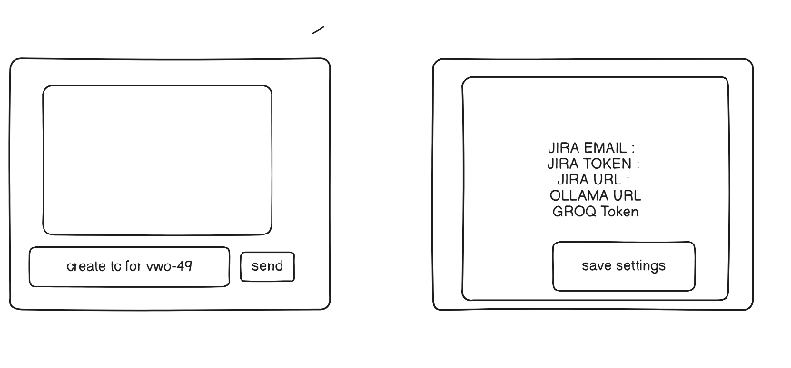

# Local Test Case Generator

A Streamlit app that turns a Jira ticket into a draft test-case suite. You type
`create test cases for VWO-49`, it fetches the ticket, injects the real
requirements into a QA template, and generates the cases with a **model running
on your own machine** — falling back to Groq only if the local one is not there.

Everything else in this repo sends the ticket to a cloud model. This one does
not have to, which is the reason it exists.

## The sketch it was built from



Two screens, and the built app is still exactly these two.

## The chat screen


Running against a local Ollama model. Note the first line of the answer —
**every response is prefixed with the provider that produced it**, so you are
never guessing whether the local model or the cloud answered.


The same request served by Groq. Same app, same template, different engine.

## The settings screen


Jira URL, email, API token and the custom field id that holds acceptance
criteria, plus the provider choice. Two details worth keeping:

- **A "Test Jira Connection" button.** Credentials are verified where they are
  entered, not discovered to be wrong later inside a generation run.
- **Secrets are never displayed after saving.** The token field renders empty
  with *"Leave blank to keep the configured token"* — so a saved secret cannot
  be read back off the screen.

## How a request flows

```
"create test cases for VWO-49"
  -> extract_ticket_key()          regex for PROJ-123, rejects anything else
  -> JiraClient.fetch_ticket()     summary, description, acceptance criteria
  -> build_prompt()                template + the real ticket text
  -> LLMClient.generate()          Ollama, or Groq
  -> "Provider: ollama\n\n<cases>"
```

`process_request` returns `(message, status)` where status is one of
`configuration`, `validation`, `error` or `success` — so a missing credential, a
malformed ticket key and a failed generation are four distinct outcomes with
four different messages, rather than one generic failure.

### The provider fallback

The part worth reading in `llm_client.py`:

```python
if self.config.provider == "groq":
    return GenerationResult(self._groq(prompt), "groq")
try:
    return GenerationResult(self._ollama(prompt), "ollama")
except LLMClientError:
    if not self.config.groq_api_key:
        raise LLMClientError("Ollama is unavailable and no Groq API key is configured for fallback.")
    return GenerationResult(self._groq(prompt), "groq-fallback")
```

Choosing Groq is explicit. Choosing Ollama means *try local first, and only
leave the machine if local fails and a key exists*. The third provider label,
`groq-fallback`, is deliberately distinct from `groq` — so the answer tells you
that your local model was down, rather than silently pretending nothing changed.

An empty Ollama response counts as a failure, not as success with no text.

## The template is the quality control

`templates/testcase_creator.md`, loaded at run time and pasted above the ticket:

```
ROLE - You are a Senior QA Engineer.
TASK - Generate [NUMBER] test cases for [FEATURE].

CONSTRAINTS
- Use ONLY the provided requirements
- Do NOT assume undocumented behavior
- If information is missing, state "Not specified"
```

Same discipline as everywhere else in this repo: never invent, and say so when
the input is thin. `01_LLM_Basics/ANTI-HALLUCINATION.rules.md` is where the rule
comes from, and the n8n agents in `07_` and `08_` enforce their own versions of
it with `Not Provided` and `Not Applicable`.

The app looks for the template at the folder root first and falls back to a
bundled copy in `src/templates/`, so it still runs if it is moved.

## Layout

```
03_LocalTestCaseGenerator/
├── plan.md                              the build spec
├── templates/testcase_creator.md        the QA prompt template
├── Generated_TCs_using_Local_Ollama.md  a real generated suite
└── TestcaseGeneratorsSrc/
    ├── Application_chart.png            the wireframe above
    ├── promt.md / finetuned_promt.md    the prompt before and after tuning
    ├── Test_Results_images/             the three screenshots above
    └── src/
        ├── app.py             Streamlit chat UI and the request flow
        ├── pages/settings.py  the settings screen
        ├── config_store.py    load, validate and save config
        ├── jira_client.py     ticket fetch, key extraction
        ├── llm_client.py      Ollama and Groq, with the fallback
        ├── requirements.txt
        └── tests/             pytest suites for all four modules
```

## Running it

From `TestcaseGeneratorsSrc/src`:

```powershell
py -3 -m pip install -r requirements.txt
py -3 -m pytest
py -3 -m streamlit run app.py
```

Configure it either in the Settings screen or with a `.env` in
`03_LocalTestCaseGenerator` or `TestcaseGeneratorsSrc/src` — gitignored, and it
must stay that way:

```text
JIRA_URL=
JIRA_EMAIL=
JIRA_TOKEN=
JIRA_ACCEPTANCE_CRITERIA_FIELD=
LLM_PROVIDER=ollama
OLLAMA_URL=http://localhost:11434
OLLAMA_MODEL=gemma3:1b
GROQ_API_KEY=
GROQ_MODEL=openai/gpt-oss-20b
```

**The app never pulls the Ollama model.** Install Ollama and `ollama pull
gemma3:1b` yourself first, or every request takes the Groq fallback.

Only four dependencies: `streamlit`, `requests`, `python-dotenv`, `pytest`. No
LLM SDK — both providers are plain HTTP calls.

## Worth remembering

- **Local-first is a fallback chain, not a switch.** Try the machine, leave it
  only when you must, and label the answer so you know which happened.
- **Verify credentials where they are entered.** The "Test Jira Connection"
  button costs one function and removes a whole class of confusing failure.
- **Distinguish your failure modes.** Missing config, a bad ticket key and a
  dead model are three different problems and deserve three different messages.
- `Generated_TCs_using_Local_Ollama.md` is what a small local model actually
  produced — useful for judging whether `gemma3:1b` is good enough for the job.
