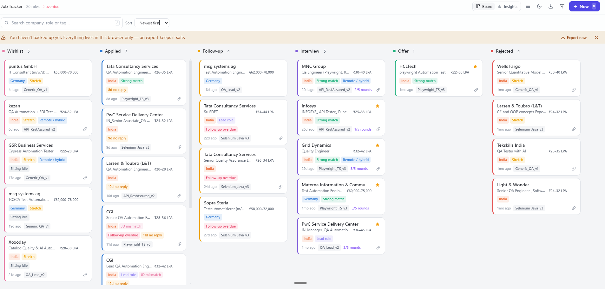
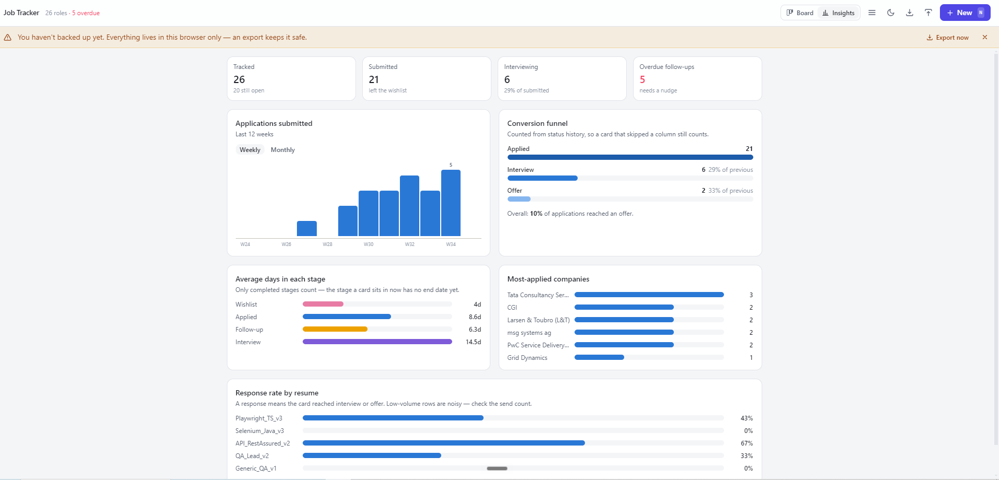

# JobTrackerAI — Local-First Job Tracker

A Kanban job-application tracker that runs entirely in the browser. No backend,
no accounts, no network calls — every card lives in IndexedDB on the machine
that created it. Close the tab and the data is still there; clear site data and
it is gone, which is why the export is prominent.

Built from the spec in `job-tracker-build-prompt.md`.

## Results

Both screenshots are of the app running against `public/seed-data.json` — the 26
real postings from `04_JobKitAI`, not mock data.

### The board — `JobTrackerAI_Kanban_BoardResult.png`



All 26 cards across the six columns, with the counts in each header. What this
one is evidence of:

- **The six status accents read as distinct hues.** An earlier draft had Wishlist
  and Interview as near-identical purples; this is the re-validated palette.
- **Card face**: company, role, salary right-aligned, tag chips, resume version,
  days since applied, priority stars, round progress (`2/5 rounds`), link icon.
- **The nudges fire on the right cards** — `Follow-up overdue` on three,
  `8d/9d/10d no reply` on stale Applied cards, `Sitting idle` on old Wishlist
  items. The header agrees: `26 roles · 5 overdue`.
- The backup banner, since nothing had been exported yet.

### The Insights dashboard — `JobTrackerAI_Analysis_Board_Result.png`



The analytics view over the same data:

- **Stat row** — tracked, submitted, interviewing, overdue.
- **Applications submitted** — weekly bars, only the peak labelled rather than
  every mark.
- **Conversion funnel** — an ordinal blue ramp narrowing through Applied →
  Interview → Offer, with the rate between stages.
- **Average days in each stage** — bars in their column accents, each row
  labelled so colour is never the only cue.
- **Most-applied companies** and **response rate by resume** — single-hue, since
  each row carries its own label.

This screenshot also happens to prove drag-and-drop works; see [Verified](#verified).

## Running it

```bash
npm install
npm run dev      # http://localhost:5173
npm run build    # production bundle into dist/
npm run preview  # serve the built bundle
```

## Stack

React 18 · Vite 6 · Tailwind 3 (class-based dark mode) · `idb` for IndexedDB ·
`@dnd-kit/core` for drag-and-drop. Charts are hand-built SVG/CSS — no charting
dependency. Plain JavaScript throughout, no TypeScript.

## Folder layout

```
05_JobTrackerAI/
├── index.html                  pre-paint theme script (avoids a flash of light mode)
├── job-tracker-build-prompt.md the spec this was built from
├── JobTrackerAI_Kanban_BoardResult.png     result screenshot — the board
├── JobTrackerAI_Analysis_Board_Result.png  result screenshot — Insights
├── public/seed-data.json       26 real postings, served at /seed-data.json
├── scripts/
│   └── seed-from-jobkit.mjs    regenerates that file from the 04_JobKitAI CSVs
├── src/
│   ├── App.jsx                 state owner: view, filters, modals, shortcuts
│   ├── index.css               colour tokens + the validated chart palette
│   ├── db/database.js          IndexedDB schema and all CRUD
│   ├── hooks/
│   │   ├── useJobs.js          the single source of truth for cards
│   │   ├── useToast.js         toasts, including the deferred-delete window
│   │   └── useSettings.js      theme + density, localStorage-backed
│   ├── lib/
│   │   ├── constants.js        columns, tag colours, thresholds
│   │   ├── dates.js            formatting, day maths, week/month bucketing
│   │   ├── nudges.js           stale / overdue rules
│   │   ├── analytics.js        funnel, dwell time, resume performance
│   │   └── exportImport.js     JSON backup round-trip
│   └── components/             board, card, form, detail panel, insights, chrome
```

## How the data model behaves

A card carries the fields in the spec — company, role, URL, resume, dates,
salary, notes, recruiter, tags, priority, interview rounds, JD snapshot,
follow-up date — plus two things the user never edits directly:

- **`history`** is append-only. `updateJob` compares the incoming status to the
  stored one and appends `{status, at}` only on a real change, so the timeline
  in the detail panel is generated rather than typed.
- **`order`** exists for within-column placement; sorting currently runs off the
  chosen sort option rather than manual reordering.

`normalizeJob` fills in every missing field, so a partial record from an older
export still loads without crashing.

## Decisions worth knowing

**Delete is deferred, not immediate.** Confirming a delete removes the card from
the board and from IndexedDB right away, but the full record is held in the
toast. Undo writes it back; letting the toast expire is what makes it permanent.

**"Submitted" means the card left the wishlist.** The funnel and the
applications-per-week chart both read `history`, not `dateApplied` — so editing
a date on a wishlist card cannot retroactively invent an application, and a card
dragged straight from Wishlist to Interview still counts as submitted.

**Average dwell time only counts closed intervals.** The stage a card currently
sits in has no end timestamp, so counting it would drag every average toward
zero. Stages with no completed transitions are omitted rather than shown as `0`.

**Response rate excludes rejections.** A resume "responded" when its card reached
Interview or Offer. A rejection is an outcome, not a response worth crediting.
Low-volume rows are noisy, so the send count sits beside every rate and a table
view shows the raw numbers.

**The chart palette was validated, not eyeballed.** The six status accents were
run through a CVD/contrast validator in both light and dark against this app's
actual surfaces. The original draft failed three checks — wishlist and interview
were nearly the same purple (ΔE 10.1, below the 15 floor) and the rejected grey
fell under the chroma floor. The current six pass every check in both modes. The
green↔red adjacency sits in the CVD 6–8 band, which is only permitted because
every column header and every chart bar is also labelled in text — colour never
carries the meaning alone. Accents resolve through CSS variables so each theme
gets its own validated step rather than an automatic flip.

## Keyboard

| Key | Action |
|---|---|
| `N` | New application |
| `/` | Focus search |
| `Esc` | Close any modal or panel; clears the search box when it has focus |

## Verified

Both screenshots referenced below are in [Results](#results) above.

- `npm run build` succeeds (~76 kB gzipped JS).
- 29 assertions over the analytics, date and nudge logic pass — funnel counts,
  dwell-time windows, resume rates, week/month bucketing, stale and overdue
  thresholds.
- The import path was exercised against a real IndexedDB implementation:
  parse, write, read-back, history and tag preservation, and re-import without
  duplicates.
- `Insights` and `JobCard` server-render without runtime errors, including the
  zero-data empty state.
- Confirmed in the browser (`JobTrackerAI_Kanban_BoardResult.png`): all six
  columns populate with the right counts, the status accents read as six
  distinct hues, salary and resume chips render on the card face, and the stale,
  overdue and idle badges fire on the cards they should.
- Insights confirmed too (`JobTrackerAI_Analysis_Board_Result.png`): the stat
  row, the weekly bars with only
  the peak labelled, the ordinal funnel ramp, the per-stage dwell bars in their
  column accents, and both single-hue ranked charts all render as designed.
- Drag-and-drop is confirmed working, indirectly but conclusively. The Insights
  screenshot reports two offers against the seed file's one, with open cards down
  from 21 to 20 and the interview dwell average shifted from 16d to 14.5d — a
  card was moved by hand, the status history recorded it, and every dependent
  figure recomputed.

Still not covered: the notification permission prompt and the responsive
breakpoints. There is no automated browser test — the checks above are a build,
a logic suite, an IndexedDB suite, server-side renders, and two screenshots.

**Known rough edge.** Putting the salary on the role line costs role width, and
long titles truncate hard at the default column size — "Qa Engineer (Playwright,
R…". Legible enough to identify a card, but the full title needs the detail
panel. Moving salary to its own line would fix it at the cost of taller cards.

## Limitations

- Data is per-browser and per-profile. There is no sync; the JSON export is the
  only way to move it or back it up, and the banner nags after 30 days.
- Browser notifications fire once per day on load, only if the permission is
  granted, and only for overdue follow-ups.
- Cards cannot be manually reordered within a column yet — sorting is by date or
  priority.
