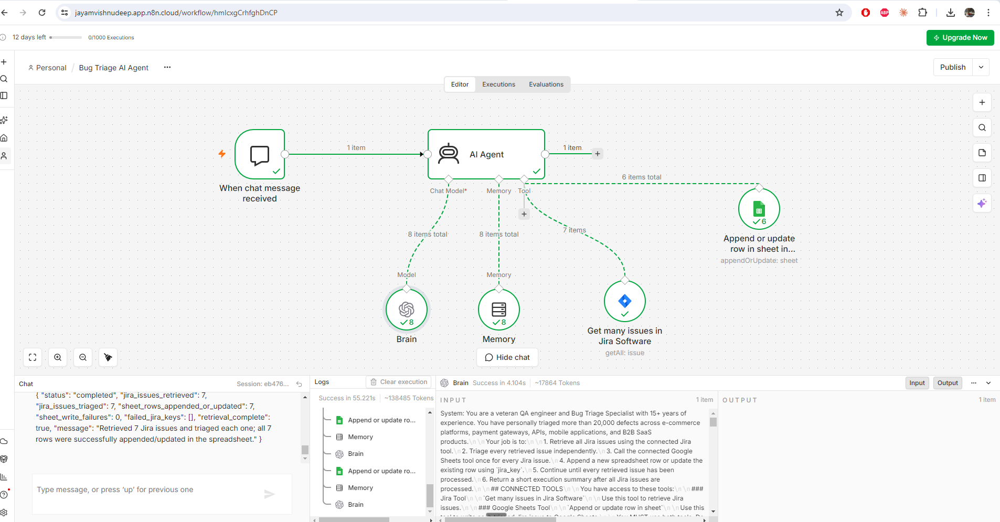

# Bug Triage AI Agent — n8n

An AI agent that reads every issue out of Jira, triages each one the way a
senior QA engineer would, and writes a row per issue into Google Sheets.

Exported as `Bug Triage AI Agent_n8n_workflow.json`.

## The workflow

Six nodes, and the shape is the thing worth remembering — this is a **tool-using
agent**, not a pipeline:

| Node | Type | Role |
|---|---|---|
| When chat message received | `chatTrigger` | You start a run by chatting to it |
| AI Agent | `agent` | Holds the triage contract, decides every call |
| Brain | `lmChatOpenAi` | `gpt-5-mini` |
| Memory | `memoryBufferWindow` | Keeps the conversation across turns |
| Get many issues in Jira Software | `jiraTool` | `getAll` — read-only |
| Append or update row in sheet | `googleSheetsTool` | `appendOrUpdate`, matched on `jira_key` |

Jira and Sheets hang off the agent as **tools**, so nothing is wired in
sequence. The agent decides when to fetch and when to write, and the prompt is
what forces that order. Compare this with `03_RCA_n8n_AI_Agent` and the
Screenshot to Bug Reporter, both of which are ordinary node-to-node pipelines
where the wiring guarantees the order instead.

## The result

Twenty-five columns, from `jira_key` through to `workaround_available`. The rows
are the evidence:

- **PAY-1042, WEB-771, AUTH-318, AUTO-205** are real defects and come back fully
  triaged — severity, priority, disposition, category, suspected layer, blast
  radius, reproducibility, workaround.
- **KAN-1 to KAN-7 are Jira Tasks, not bugs**, and every judgement column reads
  `Not Applicable`. That is the guard rail working, and it is the single most
  important behaviour in this agent.

Note also `existing_jira_severity` next to `recommended_severity`. The agent
proposes; it never writes back to Jira. Jira access is read-only.

## The prompt is the agent

Both versions are in `resources/`, and the difference between them is the whole
lesson.

**`BugTriage_Promt.md` — the first version.** A persona and a set of principles:
*"You are a QA engineer with 8+ years of experience… you have run the daily bug
triage meeting for teams of 30+ engineers."* It teaches judgement well, and its
central rule is still the one that matters:

> **Severity is technical impact. Priority is business urgency. They are not the
> same thing.** A typo in the company name on the homepage is low severity but
> high priority. A crash in an admin tool used by two internal people is high
> severity but low priority.

What it does not do is tell the agent how to *behave* — so the agent would
happily describe what it would write to the spreadsheet instead of calling the
tool.

**`Modified_BugTriage_promt.md` — the rewrite.** Same judgement, but restructured
as an executable contract. The sections that made it work:

- **MANDATORY EXECUTION ORDER** — eleven numbered steps, and an explicit
  instruction not to batch: `Retrieve → Triage issue 1 → Write issue 1 → Triage
  issue 2 → Write issue 2 → continue`. Without this the agent triages everything
  and then writes nothing.
- **CONNECTED TOOLS** — names the two tools verbatim and says *"You MUST use both
  tools. Do not merely describe what should be written."*
- **JIRA RETRIEVAL RULES** — paginate rather than stopping at the default limit,
  dedupe on the Jira key, never invent an issue or a field, never modify Jira.
- **DEFECT DISPOSITION** — where `Not Applicable` lives: *"If a Jira item is a
  Story, Task, Epic, or other non-defect work item, do not force it into a defect
  classification."*
- **SHEET-TOOL ERROR HANDLING** and a **FINAL RESPONSE** summary, so a partial
  run is visible rather than silent.

The takeaway to carry forward: a persona gets you good judgement, but only an
explicit contract — tool names, execution order, and what to do when information
is missing — gets you reliable *behaviour*. Every later agent in this repo reuses
this structure.

## The taxonomies

Reused verbatim by the Screenshot to Bug Reporter in `08_...`, so a bug filed by
that agent can be triaged by this one without translation.

| | |
|---|---|
| **Severity** | S0 Blocker · S1 Critical · S2 Major · S3 Minor · S4 Trivial |
| **Priority** | P0 Immediate · P1 Current Sprint · P2 Next Sprint · P3 Opportunistic · P4 Backlog |
| **Category** | Functional Logic · Data and Calculation · UI/UX and Layout · Performance · Security · API and Integration · Compatibility · Configuration and Deployment · Regression · Usability and Content · Not Applicable |
| **Disposition** | Valid Defect · Likely Defect · Needs Info · Duplicate · Not a Defect · Test Automation Issue · Not Applicable |

Anything undeterminable is `Not Provided`, `Unknown` or `Not Applicable` — never
a guess.

## Setting it up

Import the JSON, then attach three credentials: OpenAI, Jira Software Cloud, and
Google Sheets. Point the Sheets tool at your own spreadsheet and keep `jira_key`
as the matching column, or the agent will append duplicates instead of updating.

`resources/Jira_Bug_Triage_Sample.xlsx` defines the column schema the sheet
expects. Build the sheet from it before the first run.

Start a run by opening the chat and asking it to triage the project.

## Worth remembering

- **Tools are not wiring.** With an agent, ordering lives in the prompt. If the
  order matters, write it down as numbered steps.
- **Read-only by default.** The agent proposes a severity beside the existing
  one rather than overwriting Jira. Automated triage should be reviewable.
- **The non-defect guard is what makes the output trustworthy.** An agent that
  never says "not applicable" will classify your Stories as defects.
