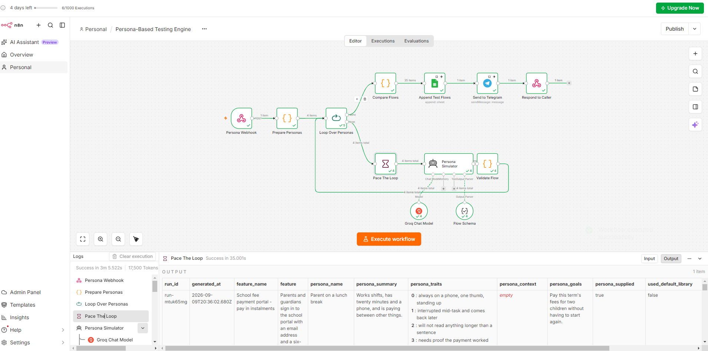
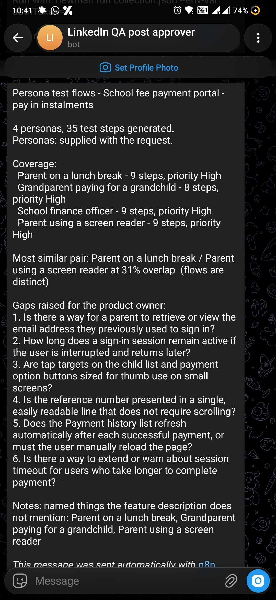

# Persona-Based Testing Engine — n8n AI Agent

A product QA describes a feature and names the people who will use it. The
engine returns a separate test flow for each of them — what a grandparent
actually does with this screen, and where a finance officer will break it — and
writes every step into Google Sheets as a working test list.

Exported as `Persona_Based_Testing_Engine_n8n_workflow.json`. The build log is in
[`plan.md`](plan.md).

## The failure mode this is built to prevent

The three agents before this one each had an obvious way of being wrong. This
one's is quiet, and it is the reason the engine needs a guard rail at all:

**A persona test generator will happily produce the same flow five times with
different names on top.**

```
Senior Citizen:  1. Open the app  2. Log in  3. Complete the task  4. Verify
Power User:      1. Open the app  2. Log in  3. Complete the task  4. Verify
```

Nothing there is malformed. The schema passes, a human skim passes, and the
sheet fills with work nobody should do. All the value is in the *difference*
between the flows — so the difference is what gets measured.

> **Two personas that produce the same flow mean the personas were ignored.**

After every persona has been generated, the engine compares each pair of flows
and flags the run when they converge. On the live cloud run the closest pair —
the parent on a lunch break and the parent using a screen reader — shared **31%
of their vocabulary**, comfortably under the 60% limit.

## Every step names the trait that caused it

The field doing the real work is `driven_by`:

```
action:     Set the tablet browser zoom to 200% before loading the portal
driven_by:  low vision, runs the browser zoomed in

action:     Tab to the email field, type the parent email, Tab to the code field
driven_by:  expects keyboard navigation and shortcuts
```

That makes a step auditable — a reviewer can ask "is that true of this persona?"
and get an answer. A step that cannot name its cause is a generic step wearing a
costume, and the validator drops it.

## The pipeline

```
Webhook                POST /persona-flows  {feature, personas[]}
  -> Prepare Personas    (Code)  normalise, default library, cap the count
  -> Loop Over Personas  (splitInBatches)
       -> Pace The Loop      (Wait 35s — the rate limit)
       -> Persona Simulator  (AI Agent + Groq + Structured Output Parser)
       -> Validate Flow      (Code)  per-persona guard rails
       -> back into the loop
  -> Compare Flows       (Code)  convergence check + one row per step
  -> Append Test Flows   (Google Sheets)
  -> Send to Telegram  ->  Respond to Caller
```

| Node | Type | Role |
|---|---|---|
| Persona Webhook | `webhook` | `POST /persona-flows`, responds via the last node |
| Prepare Personas | `code` | One item per persona; applies the default library |
| Loop Over Personas | `splitInBatches` | One agent call per persona |
| Pace The Loop | `wait` | 35s — measured, not guessed |
| Persona Simulator | `agent` | Writes one persona's flow |
| Groq Chat Model | `lmChatGroq` | `openai/gpt-oss-120b` |
| Flow Schema | `outputParserStructured` | Forces the step shape |
| Validate Flow | `code` | Drops untraceable steps, flags invented controls |
| Compare Flows | `code` | The convergence check; flattens to one row per step |
| Append Test Flows | `googleSheets` | 13 columns, appended |
| Send to Telegram | `telegram` | Run summary |
| Respond to Caller | `respondToWebhook` | Full result as JSON |



A complete run — **3 minutes 5.5 seconds, 17,500 tokens**, four personas. The
item counts along the connectors are the design made visible: `Prepare Personas`
emits **4**, the loop carries those 4 through the simulator and the validator,
and `Compare Flows` turns them into **35** — one row per test step. The open
panel is `Pace The Loop`, reading *"Success in 35.001s"*, which is the rate
limit being paid rather than gambled on.

**One agent call per persona, not one call for all of them.** A single call
producing five flows would be a large completion and risks truncation — and
asking for them separately stops the model averaging the personas together,
which is the convergence failure above.

**The comparison cannot happen inside the loop**, because each iteration only
sees itself. It hangs off the loop's *done* output, where every flow is
available at once.

## The rate limit is part of the design

A persona call measures at **~4,000 tokens** — 1,772 of prompt, because the
whole feature description is sent with every persona, and ~2,200 of completion.
Against Groq's free-tier ceiling of 8,000 per minute that is **two personas a
minute**, so the Wait node is **35 seconds**.

A four-persona run therefore takes about three minutes. Without the wait it
fails halfway, writing two rows and missing two — which looks like it worked,
and is the worst outcome available.

## The guard rails

**1. Flows must diverge.** Pairwise overlap above 60% flags the run. Identical
flows score 100% and are named in the notes.

**2. No step without a trait.** A `driven_by` that is missing, or that merely
restates the action, drops the step. The comparison is on word stems rather than
exact text, because `"Enter the card number"` against
`"entering the card number"` is the same non-answer one suffix apart.

**3. No inventing the product.** The feature description is the only source of
what exists. A step citing a `"Save for later"` button the description never
mentions is flagged; `"Pay"` is not. What a persona needs but the feature does
not describe belongs in `gaps` as a question for the product owner — a genuinely
useful finding, where an invented button is a test that cannot be run.

**4. An empty run is visible.** If every step fails validation, the sheet gets a
`NONE` row saying so. An empty sheet reads as a feature with no risks.

## Personas

Supplied personas always win. A request with none falls back to a library of
five: Power User, First-Time User, Senior Citizen, Screen-Reader User, and
Mobile-Only on a slow connection.

That library is deliberately **not** a list of demographics. Each entry carries
traits that change what a person *does* — "less precise tapping", "needs errors
announced, not only shown in red", "requests time out and are retried" — because
those are the only traits a test step can act on. Every row records
`persona_source`, so a reader can always tell a generic archetype from a
researched persona.

## Trying it

`sample_request.json` is one feature — a school fee payment portal — and four
personas written to be genuinely different: a parent on a lunch break, a
grandparent, a school finance officer, and a parent using a screen reader.

```bash
curl -X POST "https://<your-n8n-host>/webhook-test/persona-flows" \
  -H "Content-Type: application/json" \
  --data @sample_request.json
```

### The curl will time out. The run will not.

The live four-persona run took **3m 5.5s**. n8n Cloud sits behind Cloudflare,
which closes a connection that has produced nothing after about two minutes, so
that command returned **HTTP 524 at 126 seconds** — a Cloudflare error page, not
this workflow's JSON — while n8n carried on server-side and finished normally.
The Telegram summary arrived as usual.

That is not bad luck at the margin. Four personas spend **140 seconds in the
Wait node alone**, and `MAX_PERSONAS` is 6, so the ceiling only moves the wrong
way: **this webhook cannot return its JSON for a full-sized run.**

The fix is to acknowledge early — a Respond to Webhook node placed straight
after `Prepare Personas`, returning the `run_id` — and let the results arrive by
Sheets and Telegram. Trimming the wait is the tempting alternative and the wrong
one: 35 seconds is derived from measured token cost, so cutting it trades a 524
for a 429 and still will not fit six personas.

**Treat the HTTP response as a bonus and the delivery channels as the product.**

### What arrives



```
4 personas, 35 test steps generated.   Personas: supplied with the request.

  Parent on a lunch break              9 steps, priority High
  Grandparent paying for a grandchild  8 steps, priority High
  School finance officer               9 steps, priority High
  Parent using a screen reader         9 steps, priority High

Most similar pair: Parent on a lunch break / Parent using a screen reader
at 31% overlap  (flows are distinct)
```

**The overlap line is the one worth reading.** Four personas pointed at the same
payment screen, and the closest pair still shares under a third of its
vocabulary. The engine is reporting that it did the job — as a number a reviewer
can check, rather than a claim they have to take on trust.

The six gaps are the other half of the value, and not one of them is a test
step. Each traces back to a trait some persona was given:

| Gap raised for the product owner | Comes from |
|---|---|
| Can a parent retrieve the email address they previously signed in with? | *"forgets which email address was used"* |
| How long does a session stay active if the user is interrupted and returns? | *"interrupted mid-task and comes back later"* |
| Are tap targets on the child list sized for thumb use on small screens? | *"one thumb, standing up"* · *"less precise tapping"* |
| Is the reference number on a single readable line without scrolling? | *"low vision, runs the browser zoomed in"* |
| Does Payment history refresh after a payment, or must the page be reloaded? | *"needs proof the payment worked before leaving the page"* |
| Can a session timeout be extended, or warned about? | *"takes longer than a short session timeout allows"* |

That is a design review of the feature, produced as a side effect of writing
tests for it — and it is exactly what guard rail 3 exists for. A persona needing
something the description does not mention becomes a question for the product
owner, never an invented button in a step.

### One rough edge, visible in that screenshot

The final line of the summary reads:

> *Notes: named things the feature description does not mention: Parent on a
> lunch break, Grandparent paying for a grandchild, Parent using a screen reader*

Those are **persona names**, not invented controls. `Compare Flows` lists which
*flows* tripped guard rail 3, but never says **what** they named — each flow's
`invented_names` array is computed in `Validate Flow` and then dropped before the
run note is written. The warning names the accused without the accusation, so a
reader cannot act on it.

The screenshot is kept as it is, because it is what the current export actually
produces. Carrying those names through into the note is a one-line change to
`Compare Flows`, and the obvious next fix.

## Setting it up

Import the JSON. Groq, Google Sheets and Telegram all carry their credentials by
id, so nothing needs picking — the first agent in this folder where every output
node works out of the box.

Rows are appended to the existing **n8n** spreadsheet
(`163AUrBaP90RYm0dRJI...`) on a new tab, **Persona Test Flows**, alongside the
sheets `02_BugTriage` and the RCA agent already write to. Create that tab with
these 13 column headers before the first run, or point the node at your own
sheet:

```
run_id · generated_at · feature · persona · persona_source · priority
step_no · action · expected · driven_by · risk · primary_goal
accessibility_notes
```

`Append Test Flows` is set to `continueRegularOutput`, so a missing tab turns
the node amber and the run still reaches Telegram and the webhook response
rather than dying at the last step.

## Worth remembering

- **When the value is in the difference, measure the difference.** A schema
  cannot tell you the personas were ignored; comparing the outputs can.
- **Make the model show its reasoning as a field, not as prose.** `driven_by`
  turns "trust me, this is persona-specific" into something checkable.
- **Ask for fewer, better items.** Six to twelve steps truncated the response;
  five to nine returns clean and reads more like real testing work.
- **Pace loops around a rate limit deliberately.** A partial run that looks
  complete is worse than a failure that announces itself.
- **A deliberately paced workflow outgrows its own HTTP response.** The waits
  that make a run correct are the same waits that push it past the proxy's
  timeout. Once a workflow is measured in minutes, acknowledge on receipt and
  deliver out of band — holding the connection open is the part that cannot
  scale.
- **A 5xx from the host is not a failure of the workflow.** The 524 came from
  Cloudflare; n8n ran to completion and delivered. Check the execution before
  believing the status code.
- **A warning must name the thing, not the accused.** "These three flows named
  something undocumented" is unactionable without saying what they named.
- **An empty result needs a row.** Silence in a QA artefact gets read as "no
  issues found".
