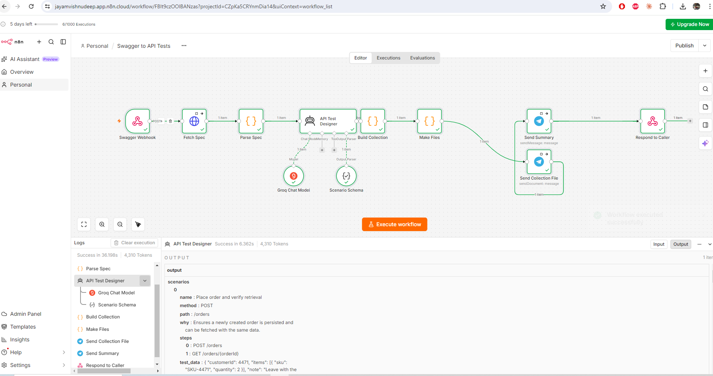
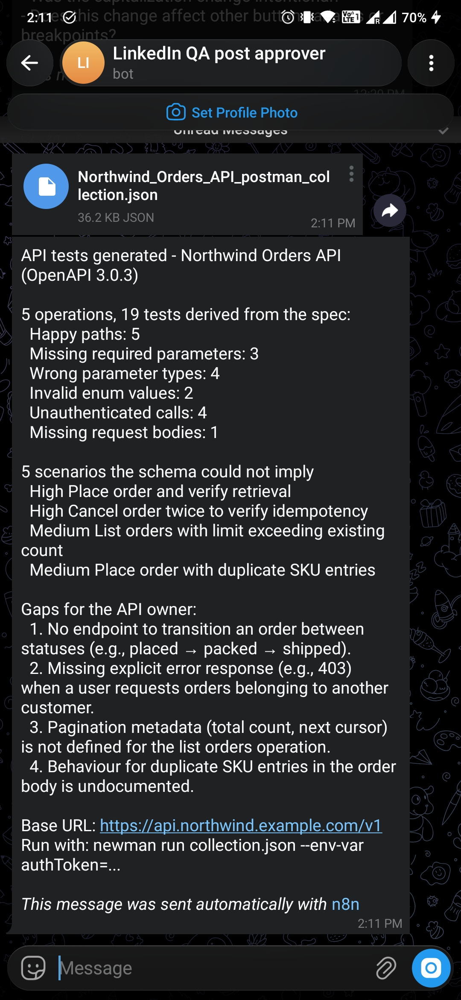

# Swagger to API Tests — n8n AI Agent

Point it at an OpenAPI spec and get back a runnable test suite: a happy path for
every operation, plus every negative test the document already implies — missing
required parameters, wrong types, invalid enums, missing bodies, and calls made
without credentials. As a Postman collection and as a RestAssured JUnit class.

Exported as `Swagger_To_API_Tests_n8n_workflow.json`. The build log is in
[`plan.md`](plan.md).

## The rule

> **Everything the spec determines is generated by code. The model only adds
> what a schema cannot imply.**

A test derived from the document is *correct by construction*. If the spec says
`orderId` is a required integer path parameter and the operation returns 200 or
404, then a test that omits it and expects a 4xx is right without anyone
checking it. A model-invented endpoint is a test that 404s on its first run —
and a suite whose first few tests fail on the first run gets deleted, along with
any trust in the tool that wrote it.

That split also solves the coverage problem for free. **The deterministic tests
are generated for every operation, however large the spec**, because generating
them costs no tokens. Only the edge-case pass is budgeted, so coverage does not
degrade as the spec grows — the opposite of what happens if the whole job is
handed to a model.

On the sample spec, five operations produce **19 tests with no model
involvement**:

```
happy_path 5 · missing_required 3 · wrong_type 4
invalid_enum 2 · missing_body 1 · no_auth 4
```

## What code generates, per operation

| Test | Derived from |
|---|---|
| Happy path | path, method, and `example` → `default` → `enum` → type |
| Missing required parameter | `required: true`, one test per parameter |
| Wrong parameter type | `type` on each integer, number or boolean param |
| Invalid enum value | `enum` on a parameter |
| Missing request body | `requestBody.required` |
| No credentials | `security` / `securitySchemes` |

Every assertion uses the status codes the spec **actually documents**, taken
from that operation's `responses` map rather than a generic 4xx. So each test
doubles as a check that the API and its documentation still agree.

## What the model adds

Only for operations the parser found, and only what a schema cannot state.
From the live run against the sample:

```
[High]   DELETE /orders/{orderId}   Cancel an already-cancelled order
         why: ensures the API is idempotent and returns a conflict
[High]   GET /orders/{orderId}      Fetch order after cancellation shows cancelled status
[Medium] GET /orders                status=cancelled returns only cancelled orders
[Medium] GET /orders                limit truncates without padding
```

Sequences, state, ownership, idempotency, and values that are type-valid but
wrong for the domain. It also raises **gaps** — coverage the spec makes
impossible. On the sample it noticed there is no endpoint to move an order from
`placed` to `packed` or `shipped`, so state-dependent behaviour cannot be tested
at all. That is a finding worth sending to the API owner.

Because those scenarios need set-up and sequencing a generated request cannot
express, they land in the collection as a folder of **documented stubs** with a
failing `TODO` assertion — not as requests pretending to be runnable.

## The guard rail

**A model asked to write tests from a spec will produce plausible tests for
endpoints that do not exist.** So every scenario is checked against the parsed
document: the `method` + `path` must exist, and the fields it names must be
declared on that operation. Anything else is dropped and listed in
`scenarios_rejected`.

Tested by attacking it — a scenario for `POST /orders/{orderId}/refund` is
dropped and named, and a `PATCH` on an operation that only allows `GET` and
`DELETE` is dropped too.

## The pipeline

```
Webhook             POST /swagger-tests  { spec_url | spec, base_url }
  -> Fetch Spec         (HTTP Request)  when a URL was given
  -> Parse Spec         (Code)  resolve $refs, enumerate operations,
                                generate every deterministic test
  -> API Test Designer  (AI Agent + Groq + Structured Output Parser)
  -> Build Collection   (Code)  verify against the spec, assemble both artefacts
  -> Make Files         (Code)  both artefacts as downloadable files
  -> Send Collection File -> Send Summary -> Respond to Caller
```

| Node | Type | Role |
|---|---|---|
| Swagger Webhook | `webhook` | `POST /swagger-tests` |
| Fetch Spec | `httpRequest` | Survivable — an inline spec skips it |
| Parse Spec | `code` | `$ref` resolution and the whole baseline suite |
| API Test Designer | `agent` | Scenarios only |
| Groq Chat Model | `lmChatGroq` | `gpt-oss-120b` |
| Scenario Schema | `outputParserStructured` | Forces `method` + `path` so they can be checked |
| Build Collection | `code` | Guard rail, Postman v2.1, RestAssured |
| Make Files | `code` | Both files at once - see below |
| Send Collection File / Send Summary | `telegram` | The collection as an attachment, then the summary |
| Respond to Caller | `respondToWebhook` | Everything, as JSON |



A completed run at **4,310 tokens**. The output panel is showing the designer's
first scenario — `POST /orders`, *"Place order and verify retrieval"*, with its
`steps` listing `POST /orders` then `GET /orders/{orderId}`. That is the shape
the guard rail checks: both calls name operations the spec declares.

**The model never sees the spec.** The parser reads a 6 MB document in full and
hands the agent a one-page summary of operations, so spec size cannot push the
run out of a context window.

**Why one Code node makes both files instead of two Convert to File nodes.**
That node's `toText` operation returns `{ json: {}, binary: { ...one key } }` —
it discards the item's json and any binary already on it, so a second one
downstream finds nothing to convert. The first live run failed on exactly that.
The same is true of the Telegram nodes, which return their own API response, so
the document is sent immediately after the binaries are made rather than after
the summary.

## Two things the input fights

**`$ref` is everywhere** — the real Swagger Petstore uses it 43 times. Without
resolution a request body is just `{"$ref": "#/components/schemas/Pet"}` and no
example can be built. The parser resolves local references, capped at six
**hops** so a self-referential schema stops rather than hangs.

**Most specs in the wild are YAML, and a Code node has no YAML parser.** v1 is
JSON only and says so with the fix in the message:

> *"This looks like a YAML spec, and only JSON is supported. Fetch the JSON form
> instead (/v3/api-docs on Spring Boot, /openapi.json on FastAPI), or convert it
> once with: swagger-cli bundle spec.yaml -o spec.json"*

Hand-rolling a YAML parser to avoid saying "convert it first" would be the wrong
trade.

## Trying it

`sample_openapi.json` is an orders API shaped to exercise every branch: required
and optional parameters, a typed path parameter, enums, a request body behind a
nested `$ref`, and bearer auth on some operations but not all.

```bash
curl -X POST "https://<your-n8n-host>/webhook-test/swagger-tests" \
  -H "Content-Type: application/json" \
  -d "{\"spec\": $(cat sample_openapi.json)}"
```

Or send `{"spec_url": "https://your-api/v3/api-docs"}` to pull a live one, and
`base_url` to override the server the tests point at.

Measured against the live workflow: **HTTP 200 in 9.0 seconds**, 19 deterministic
tests plus 5 scenarios, a 7-folder / 24-request collection and a 320-line Java
class.

Both were then checked as artefacts. The collection parses, hardcodes no host,
leaves no `$ref` unresolved in any request body, and every scenario stub calls
`pm.expect.fail` so it cannot pass silently. The Java compiles under `javac`
with zero syntax errors — the only two errors are the missing JUnit jars.

### What arrives



The collection arrives as a **36.2 KB attachment** with the summary underneath —
both delivery paths in one screenshot, which is what the node reorder was for.

The four gaps in that message are the part worth reading twice. None of them are
test results; they are things the specification does not say, found by trying to
write tests against it:

1. No endpoint transitions an order between statuses
2. No explicit 403 documented for requesting another customer's orders
3. No pagination metadata defined for list orders
4. Behaviour for duplicate SKU entries is undocumented

That is a code review of the API contract, produced as a side effect of
generating its tests.

Run what comes back with:

```bash
newman run collection.json --env-var authToken=...
```

## Setting it up

Import the JSON. Groq and Telegram carry their credentials by id, so nothing
needs picking. The generated collection uses `{{baseUrl}}` and `{{authToken}}`
variables rather than hardcoding either, so the same file works against local,
staging and CI.

## Worth remembering

- **Generate what the document determines; ask the model for the rest.** It is
  cheaper, it is correct by construction, and it makes coverage independent of
  the token budget.
- **A depth cap must count `$ref` hops, not object nesting.** Counting nesting
  passes on a shallow sample and silently degrades on real specs: a reference a
  few levels down is left unresolved, and the example built from it comes out as
  the literal string `"string"`. Only a *cycle* can recurse forever, so hops are
  the right thing to limit.
- **Don't pretend a stub is runnable.** Scenarios needing set-up ship as
  documented TODOs. A green suite that never ran the interesting tests is worse
  than an honestly incomplete one.
- **Assert the documented status codes, not a generic 4xx.** It costs nothing
  and turns every negative test into a spec-drift check.
- **Assume every n8n node replaces `$json`, and read what you need by node
  name.** This is the third node in this folder to do it — the HTML node in
  `03_`, filesystem-mode binary in `05_`, and `convertToFile` here, which also
  drops any binary already on the item. Two of them chained can never work.
- **Verify the artefact, not the text that produced it.** The collection is
  parsed and inspected; the Java is put through `javac`. "Ready to run" is a
  claim worth checking, and it turned out to be checkable after I had written
  in the plan that it was not.
