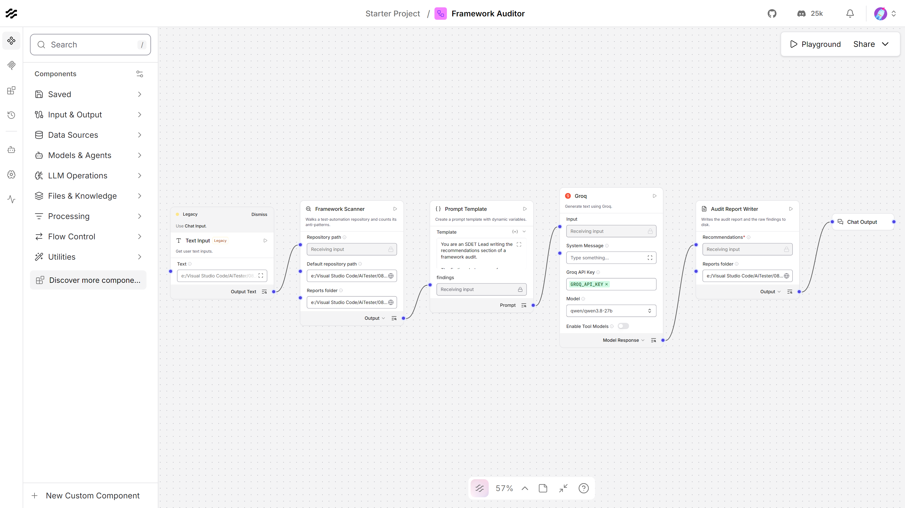
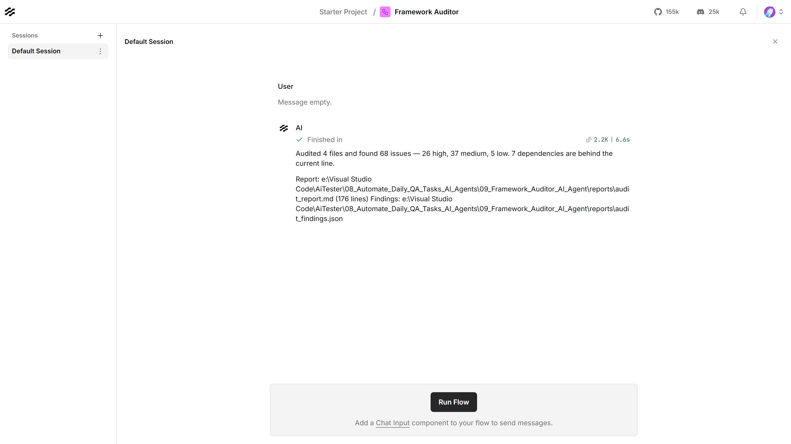

# Framework Auditor — Langflow AI Agent

Walks an automation repository, counts its anti-patterns and out-of-date
dependencies, and writes an audit report with prioritised recommendations.



| | |
|---|---|
| **Input** | A path to an automation repository |
| **Output** | `audit_report.md` and `audit_findings.json` |
| **Understands** | Java / Maven / TestNG / Selenium, and TypeScript / npm / Playwright |
| **Built with** | Langflow 1.12, Groq (`qwen/qwen3.8-27b`) |
| **Helpful for** | Arguing for remediation time with evidence rather than opinion |

---

## What it produces

A report in two halves. The first is **counted** — every number comes from a
scan, so it can be defended in a planning meeting:

| Severity | Anti-pattern | Occurrences | Files |
|---|---|---:|---:|
| HIGH | Hard-coded sleep | 15 | 4 |
| HIGH | Absolute XPath | 5 | 3 |
| HIGH | Static mutable driver | 3 | 3 |
| HIGH | Assertion inside a page object | 2 | 1 |
| MEDIUM | WebDriver call in the test layer | 15 | 2 |

…plus a dependency table, and an appendix listing every occurrence with its file
and line.

The second half is the model's, and is labelled as such — what to fix first and
why it is worth the time:

> **Fix first**
> 1. **Replace static drivers with instance-scoped drivers.** Refactor
>    `DriverFactory.java:10` and `CheckoutTest.java:14`… This is a medium-sized
>    refactor (touching 3 files) but buys immediate parallelization capability.
> 2. **Eliminate hard-coded sleeps.** Replace the 15 occurrences of
>    `Thread.sleep`… a low-effort change that removes seconds of dead time from
>    every run.

**The model never sees your source code.** It is given the counts, the dependency
versions, and a dozen quoted lines from the worst offenders — nothing else. That
is why the audit works the same on a repository of four files or four thousand.

---

## Contents

| File | What it is |
|---|---|
| `Framework_Auditor_langflow_flow.json` | The flow. Import this into Langflow |
| `framework_scanner.py` | Walks the repository and counts what is in it |
| `audit_report_writer.py` | Composes the report and writes it out |
| `test_framework_auditor.py` | Their tests — 79, no Langflow needed |
| `sample_framework_java/` | A Selenium/Maven framework with deliberate debt |
| `sample_framework_ts/` | A Playwright framework with deliberate debt |
| `reports/` | Output — the report and the raw findings |
| `plan.md` | Why it is built this way |

> The two `sample_framework_*` folders are **audit fodder**. Every file in them is
> deliberately bad and marked as such at the top. Do not copy anything from them.

---

## Requirements

- **Langflow** running, normally at `http://127.0.0.1:7860`
- **A Groq API key** — free from [console.groq.com](https://console.groq.com)

---

## Setup

**1. Store the Groq key in Langflow.** Settings → Global Variables → Add New.
Name it exactly `GROQ_API_KEY`, type **Credential**.

**2. Import the flow.** New Flow → Import → `Framework_Auditor_langflow_flow.json`.

**3. Set the reports folder on both nodes.** The **Framework Scanner** and the
**Audit Report Writer** each have a **Reports folder** field, and they must point
at the same place — the scanner writes `audit_findings.json` there and the writer
reads it back:

```
C:/Users/you/AiTester/08_Automate_Daily_QA_Tasks_AI_Agents/02_Langflow_Agents/09_Framework_Auditor_AI_Agent/reports
```

Also set the scanner's **Default repository path** to the framework you want
audited. Both hold absolute paths from the machine the flow was built on, so they
are the values to change after cloning.

---

## Usage

Put the path to the repository in the **Text Input** node, then
**Playground → Run Flow**.



Try it with what is already in the node — `sample_framework_java`. Point it at
`sample_framework_ts` for the Playwright rules, or at any repository on your
machine.

### What it looks for

| | Java / Selenium | TypeScript / Playwright |
|---|---|---|
| **Waits** | `Thread.sleep`, implicit waits, polling loops | `waitForTimeout`, `setTimeout` sleeps, `networkidle`, minute-plus timeouts |
| **Locators** | absolute and index-based XPath, styling-class selectors | the same, plus `nth-child` |
| **Structure** | `findElement` in tests, assertions in page objects, static drivers, page objects returning `WebElement` | literal selectors in tests, a `Page` shared at module scope, `workers: 1` |
| **Hygiene** | `@Ignore`, empty catch blocks, `System.out` | `test.skip`, `test.fixme`, `console.log`, an `expect()` with no `await` |
| **Both** | credentials and environment URLs in source, commented-out code | |
| **Dependencies** | `pom.xml` versions, compiler target | `package.json` versions, unpinned ranges |

Rules are deliberately narrow. `getByRole('button', { name: 'Sign in' })` is a
good locator and is never flagged; `page.click('button.btn--primary')` is not and
always is. Each rule is tested against both.

### From the API

```bash
curl -X POST "http://127.0.0.1:7860/api/v1/run/<flow-id>?stream=false" \
  -H "Content-Type: application/json" \
  -H "x-api-key: <langflow-key>" \
  -d '{
        "output_type": "chat",
        "input_type": "text",
        "input_value": "C:/path/to/your/automation/repo"
      }'
```

### Running the component tests

No Langflow and no network needed:

```bash
09_LangFlow/.venv/Scripts/python.exe test_framework_auditor.py
```

---

## Auditing your own repository

Point the **Text Input** at the root of your framework. The scanner skips
`node_modules`, `target`, `build`, `dist`, `.git`, virtualenvs and test output on
its own, and ignores files over 512 KB so a checked-in bundle cannot swamp the
count.

Read the appendix before the recommendations. The counts are exact, but whether a
given occurrence is worth fixing is a judgement about your codebase that neither
the scanner nor the model can make for you.

---

## Troubleshooting

| What you see | What to do |
|---|---|
| `No readable repository path` | The Text Input is empty and no default is set — setup step 3 |
| `No Java or TypeScript source files under …` | The path is not a framework root, or everything under it is skipped |
| `No audit_findings.json in …` | The two Reports folder fields do not match — setup step 3 |
| `Set a reports folder` | The writer's Reports folder is empty |
| The report has recommendations but no tables | The findings JSON was not written; check the scanner ran |
| `Invalid API key` | The global variable must be named exactly `GROQ_API_KEY` |
| Recommendations cut off mid-sentence | Raise **Max Tokens** on the Groq node |
