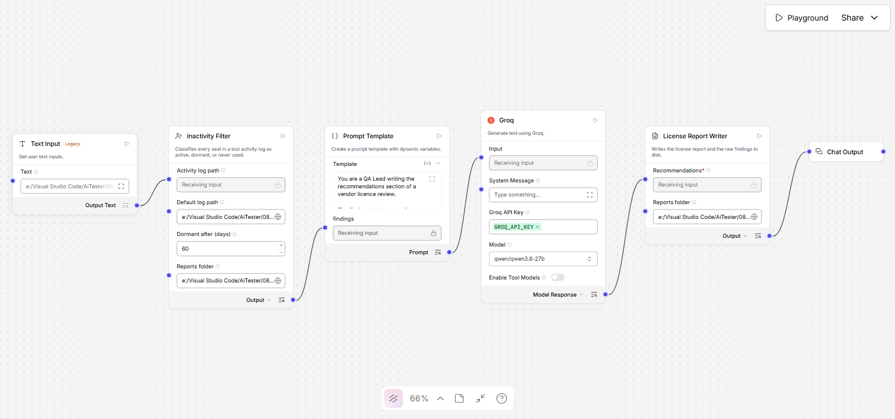
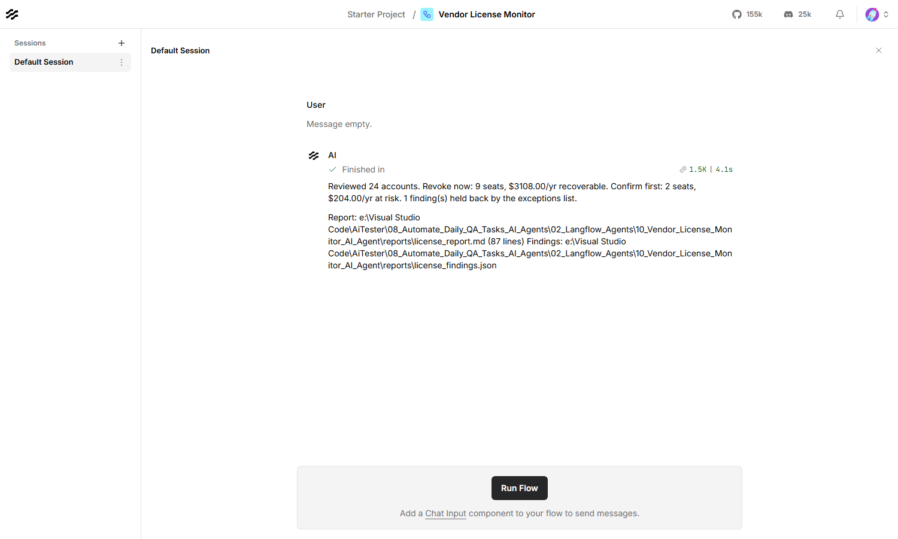

# Vendor License Monitor — Langflow AI Agent

Reads a tool login activity export, works out which paid seats nobody is using,
and writes a report that says what each one costs and which are safe to cut.



| | |
|---|---|
| **Input** | A tool activity export — CSV or JSON, auto-detected |
| **Output** | `license_report.md` and `license_findings.json` |
| **Decides in code** | Who is dormant, which tier they fall in, what it costs |
| **Built with** | Langflow 1.12, Groq (`qwen/qwen3.8-27b`) |
| **Helpful for** | Cutting tool spend without cutting off someone who needs the tool |

---

## What it produces

Every account is sorted into one of two tiers, and the split is arithmetic, not
opinion:

- **Revoke now** — never used at all, or idle for at least twice the dormancy
  threshold. There is nothing to discuss about a seat that has never been
  logged into.
- **Confirm first** — dormant, but not long enough to cut without asking.

From the sample log that ships here:

| | |
|---|---|
| Accounts reviewed | 24 |
| Active | 10 |
| Dormant | 10 |
| Never activated | 2 |
| Inside grace period | 2 |
| **Revoke now** | **9 seats — $259.00/mo, $3108.00/yr** |
| Confirm first | 2 seats — $17.00/mo, $204.00/yr |

…then a per-tool table, which is where the more interesting answer usually is:

| Tool | Seats | Flagged | Dormant fraction | Annual |
|---|---:|---:|---:|---:|
| BrowserStack | 6 | 4 | 67% | $2016.00 |
| TestRail | 4 | 2 | 50% | $816.00 |
| Jira | 10 | 4 | 44% | $408.00 |
| Confluence | 4 | 1 | 25% | $72.00 |

…then a row per flagged account with its last login, and last of all the model's
section, labelled as the model's:

> **Worth renegotiating**
> BrowserStack is the primary candidate for contract renegotiation. With a
> dormant fraction of 0.67, the issue is structural rather than individual,
> suggesting the current seat count is misaligned with actual usage patterns.
>
> **Before you revoke**
> Two Jira seats require confirmation before action: Noor Hassan (80 days since
> last login) and Priya Sharma (110 days since last login)…

**The model never decides who loses access.** It is handed the finished tiers and
totals and asked to prioritise across them. It cannot move an account between
tiers, and every dollar figure it writes has to be one already in the findings.

---

## Contents

| File | What it is |
|---|---|
| `Vendor_License_Monitor_langflow_flow.json` | The flow. Import this into Langflow |
| `license_activity_filter.py` | Reads the log and classifies every seat |
| `license_report_writer.py` | Composes the report and writes it out |
| `test_vendor_license_monitor.py` | Their tests — 132, no Langflow needed |
| `sample_logs/tool_activity.csv` | A 24-seat CSV export across four tools |
| `sample_logs/vendor_tools.json` | The same idea in the nested JSON shape |
| `reports/` | Output — the report and the raw findings |
| `plan.md` | Why it is built this way |

---

## Requirements

- **Langflow** running, normally at `http://127.0.0.1:7860`
- **A Groq API key** — free from [console.groq.com](https://console.groq.com)

---

## Setup

**1. Store the Groq key in Langflow.** Settings → Global Variables → Add New.
Name it exactly `GROQ_API_KEY`, type **Credential**.

**2. Import the flow.** New Flow → Import →
`Vendor_License_Monitor_langflow_flow.json`.

**3. Set the reports folder on both nodes.** The **Inactivity Filter** and the
**License Report Writer** each have a **Reports folder** field, and they must
point at the same place — the filter writes `license_findings.json` there and
the writer reads it back:

```
C:/Users/you/AiTester/08_Automate_Daily_QA_Tasks_AI_Agents/02_Langflow_Agents/10_Vendor_License_Monitor_AI_Agent/reports
```

Also set the filter's **Default log path** to the export you want reviewed. Both
fields hold absolute paths from the machine the flow was built on, so they are
the values to change after cloning.

**4. Clear the reference date** when you point it at a real log. The shipped flow
pins **Reference date** to `2026-09-19` so the sample keeps demonstrating all
four statuses however long from now you clone this. Empty means today, which is
what you want against live data.

---

## Usage

Put the path to the activity log in the **Text Input** node, then
**Playground → Run Flow**.



### The fields that change the answer

| Field | Default | What it does |
|---|---|---|
| **Dormant after (days)** | 60 | No login in this long makes a seat dormant |
| **New-account grace period** | 14 | A never-used account this new is *new*, not dormant |
| **Exceptions** | — | Accounts that must never be flagged, one per line |
| **Reference date** | — | Measure against a fixed date instead of today |

The revoke-now cutoff is twice the dormancy threshold and is not separately
configurable — one number to argue about is enough.

**Exceptions** take any of three shapes, matched case-insensitively:

```
kai@shopfront.example.com
kai@shopfront.example.com - approved leave, back in October
kai@shopfront.example.com: shared service account
```

A suppressed account is not dropped. It appears in its own table with the tier
it would have been in and the reason given, because an exception applied
silently is indistinguishable from a bug.

### Input formats

Either shape works and the filter tells them apart on its own.

**CSV** — one row per seat:

```csv
tool,plan,user_email,user_name,account_created,last_login,seat_cost_month
Jira,Standard,ada@shopfront.example.com,Ada Lovelace,2024-01-10,2026-09-16,8.50
Jira,Standard,zara@shopfront.example.com,Zara Ahmed,2024-04-01,,8.50
```

An empty `last_login` means the account has never been used. Every column is
required; a missing one stops the run rather than being guessed at.

**JSON** — grouped by tool, so the seat cost is stated once:

```json
{
  "tools": [
    {
      "name": "Postman",
      "plan": "Team",
      "seat_cost_month": 12.00,
      "users": [
        { "email": "ada@shopfront.example.com", "name": "Ada Lovelace",
          "account_created": "2024-01-10", "last_login": "2026-09-14" },
        { "email": "ben@shopfront.example.com", "name": "Ben Carter",
          "account_created": "2026-09-09", "last_login": null }
      ]
    }
  ]
}
```

### From the API

```bash
curl -X POST "http://127.0.0.1:7860/api/v1/run/<flow-id>?stream=false" \
  -H "Content-Type: application/json" \
  -H "x-api-key: <langflow-key>" \
  -d '{
        "output_type": "chat",
        "input_type": "text",
        "input_value": "C:/path/to/your/activity-export.csv"
      }'
```

### Running the component tests

No Langflow and no network needed:

```bash
09_LangFlow/.venv/Scripts/python.exe test_vendor_license_monitor.py
```

---

## Using it on your own logs

Export the seat list from the tool's admin console — every one of Jira,
BrowserStack, TestRail and Confluence can produce a CSV with a last-login
column. Rename the columns to match the header above and point the **Text
Input** at the file.

Two things are worth doing before anyone acts on the output. Put known leave,
contractors and service accounts in the **Exceptions** field first, so the list
you circulate has already had them removed. And treat **confirm first** as what
it says: a seat idle for 70 days belongs to someone who may be mid-secondment,
on leave, or simply between projects.

---

## Troubleshooting

| What you see | What to do |
|---|---|
| `No activity log reached this component…` | The Text Input is empty and no default is set — setup step 3 |
| `CSV log is missing column(s): …` | Rename your export's columns to match the header above |
| `JSON log has no "tools" list at the top level` | The file parsed as JSON but is not the shape above |
| `CSV line 7: missing 'tool'` | That row is incomplete; the line number is the one in the file |
| `'01/02/2024' is not a valid date` | Dates must be ISO — `YYYY-MM-DD` |
| `No license_findings.json in …` | The two Reports folder fields do not match — setup step 3 |
| `Set a reports folder` | The writer's Reports folder is empty |
| Everyone looks dormant | **Reference date** is still pinned to the sample date — setup step 4 |
| `Invalid API key` | The global variable must be named exactly `GROQ_API_KEY` |
| Recommendations cut off mid-sentence | Raise **Max Tokens** on the Groq node |
