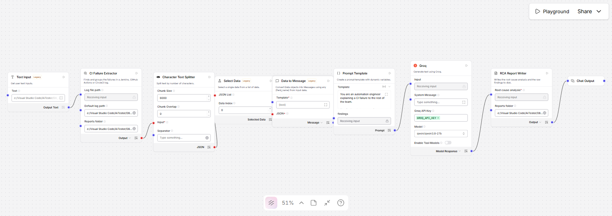
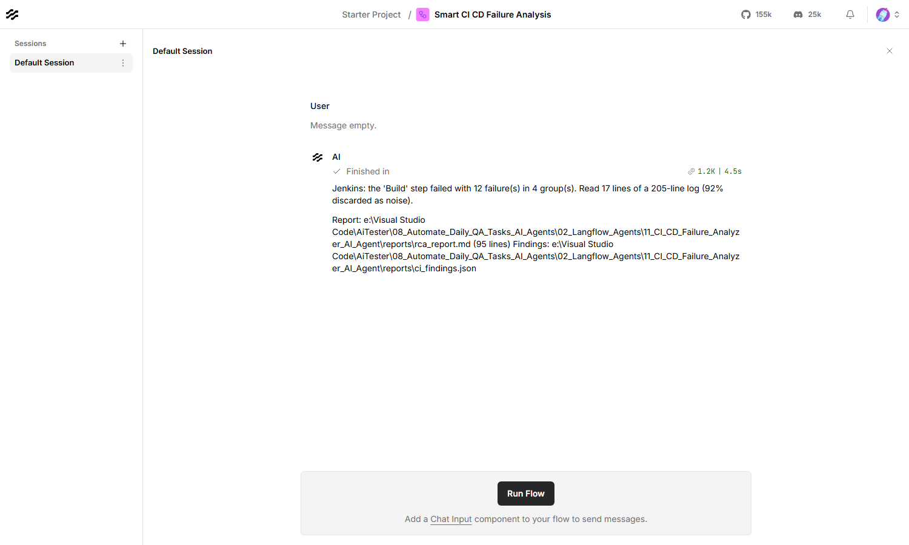

# Smart CI/CD Failure Analysis — Langflow AI Agent

Reads a Jenkins, GitHub Actions or CircleCI log, finds the lines that explain
why the build failed, groups them by cause, and writes a root cause analysis.



| | |
|---|---|
| **Input** | A CI log — Jenkins, GitHub Actions or CircleCI |
| **Output** | `rca_report.md` and `ci_findings.json` |
| **Decides in code** | Which lines matter, what category they are, how they group |
| **Built with** | Langflow 1.12, Groq (`qwen/qwen3.8-27b`) |
| **Helpful for** | Not scrolling four thousand lines to find one stack trace |

---

## What it produces

The Jenkins sample in this folder is 205 lines. **17 of them reach the model** —
the rest is Maven downloading jars, git plumbing, and the tests that passed.

| | |
|---|---|
| CI system | Jenkins |
| Failed step | Build |
| Exit code | 1 |
| Log length | 205 lines |
| Read by the model | 17 lines (92% of the log discarded as noise) |
| Failures | **12** in 4 distinct group(s) |
| Tests | 25 run, **12 failed**, 11 passed, 2 skipped |

The grouping is the part worth having. Twelve tests went red, and they are not
twelve problems:

| Severity | Category | Occurrences | First seen |
|---|---|---:|---:|
| HIGH | Unhandled exception | 9 | line 102 |
| MEDIUM | Assertion failure | 1 | line 165 |
| MEDIUM | Assertion failure | 1 | line 170 |
| MEDIUM | Timeout | 1 | line 175 |

Each group is then quoted with the line it came from, so the analysis can be
checked against the log. Last comes the model's section, labelled as the
model's:

> **Why it failed**
> The build broke because `CheckoutPage.getTotalText()` returned `null`, causing
> a `NullPointerException` in `getTotal()`. This single defect cascaded into 9 of
> the 12 test failures. The remaining three failures are distinct issues…

**The model never sees the log.** It is given the groups, the counts and a few
quoted lines. That is why the analysis costs the same on a 200-line log and a
200,000-line one.

---

## Contents

| File | What it is |
|---|---|
| `CI_CD_Failure_Analysis_langflow_flow.json` | The flow. Import this into Langflow |
| `ci_failure_extractor.py` | Finds, categorises and groups the failures |
| `rca_report_writer.py` | Composes the report and writes it out |
| `test_ci_failure_analyzer.py` | Their tests — 98, no Langflow needed |
| `sample_logs/jenkins_maven_failure.log` | 12 failures, 9 sharing one cause |
| `sample_logs/github_actions_playwright_failure.log` | 3 failures, 2 the same timeout |
| `sample_logs/circleci_npm_failure.log` | An npm dependency conflict, no tests run |
| `sample_logs/jenkins_successful_build.log` | A build that passed — the agent refuses it |
| `reports/` | Output — the report and the raw findings |
| `plan.md` | Why it is built this way |

---

## Requirements

- **Langflow** running, normally at `http://127.0.0.1:7860`
- **A Groq API key** — free from [console.groq.com](https://console.groq.com)

---

## Setup

**1. Store the Groq key in Langflow.** Settings → Global Variables → Add New.
Name it exactly `GROQ_API_KEY`, type **Credential**.

**2. Import the flow.** New Flow → Import →
`CI_CD_Failure_Analysis_langflow_flow.json`.

**3. Set the reports folder on both nodes.** The **CI Failure Extractor** and
the **RCA Report Writer** each have a **Reports folder** field, and they must
point at the same place — the extractor writes `ci_findings.json` there and the
writer reads it back:

```
C:/Users/you/AiTester/08_Automate_Daily_QA_Tasks_AI_Agents/02_Langflow_Agents/11_CI_CD_Failure_Analyzer_AI_Agent/reports
```

Also set the extractor's **Default log path** to the log you want analysed.
Both hold absolute paths from the machine the flow was built on, so they are
the values to change after cloning.

---

## Usage

Put the path to the log in the **Text Input** node, then
**Playground → Run Flow**.



Try it with what is already in the node, then point it at the GitHub Actions or
CircleCI sample, or at a log from your own pipeline.

### What the nodes do

| Node | Its job |
|---|---|
| **CI Failure Extractor** | Detects the CI system, refuses a log that did not fail, matches the error lines, categorises and groups them, counts everything, writes the findings to disk |
| **Character Text Splitter** → **Select Data** → **Data to Message** | A ceiling. The extractor's brief normally passes through whole; if a pathological log produces an enormous one, only the first chunk goes to the model — and the brief leads with the counts so the facts survive the cut |
| **Prompt Template** → **Groq** | Explains the groups. Forbidden to recount, to invent failures, or to describe log output it was not given |
| **RCA Report Writer** | Puts the model's explanation under the counted evidence, never in place of it |

### What it recognises

| | |
|---|---|
| **CI systems** | Jenkins (`[Pipeline]`, `BUILD FAILURE`), GitHub Actions (`##[error]`, `##[group]`), CircleCI (`====>>`, `Exited with code exit status`) |
| **Categories** | dependency resolution, compilation, infrastructure and resource limits, missing configuration, network, timeout, assertion failure, unhandled exception |
| **Counted results** | Maven's `Tests run: … Failures: … Errors: …`, Playwright's `N passed` / `N failed` |

Categories are ordered so the specific cause beats the generic one: a build that
fails to resolve a dependency also prints `BUILD FAILURE`, and the dependency
error is the useful answer.

### Tuning

| Field | Default | What it does |
|---|---|---|
| **Quoted lines per group** | 6 | How much of each failure the model is shown |
| **Groups in the brief** | 8 | Caps how many groups are described, largest first |
| **Chunk Size** (splitter) | 6000 | The hard ceiling on characters reaching the model |

### From the API

```bash
curl -X POST "http://127.0.0.1:7860/api/v1/run/<flow-id>?stream=false" \
  -H "Content-Type: application/json" \
  -H "x-api-key: <langflow-key>" \
  -d '{
        "output_type": "chat",
        "input_type": "text",
        "input_value": "C:/path/to/your/build.log"
      }'
```

### Running the component tests

No Langflow and no network needed:

```bash
09_LangFlow/.venv/Scripts/python.exe test_ci_failure_analyzer.py
```

---

## Using it on your own builds

Save the console output to a file and point the **Text Input** at it. In Jenkins
that is `.../job/<name>/<build>/consoleText`; in GitHub Actions it is the
"Download log archive" option on the run; in CircleCI it is the step output.

Two behaviours are worth knowing before you rely on it. **A log from a build
that passed is refused**, not analysed — there is no root cause for a success,
and a model asked for one anyway will write a convincing description of a
failure that never happened. And **a failed run with no recognisable error line
is also refused**, which usually means the failing step wrote its output
somewhere else, such as a test report published as an artefact.

---

## Troubleshooting

| What you see | What to do |
|---|---|
| `No CI log reached this component` | The Text Input is empty and no default is set — setup step 3 |
| `This log does not contain a failure` | The log is from a build that passed, or has no failure marker |
| `no recognisable error line was found` | The run failed but the reason is not in this log — check the artefacts |
| `No ci_findings.json in …` | The two Reports folder fields do not match — setup step 3 |
| `Set a reports folder` | The writer's Reports folder is empty |
| The analysis stops mid-sentence | Raise **Max Tokens** on the Groq node |
| The failed step says `not identified` | The log has no stage or step markers; the rest of the analysis is unaffected |
| `Invalid API key` | The global variable must be named exactly `GROQ_API_KEY` |
