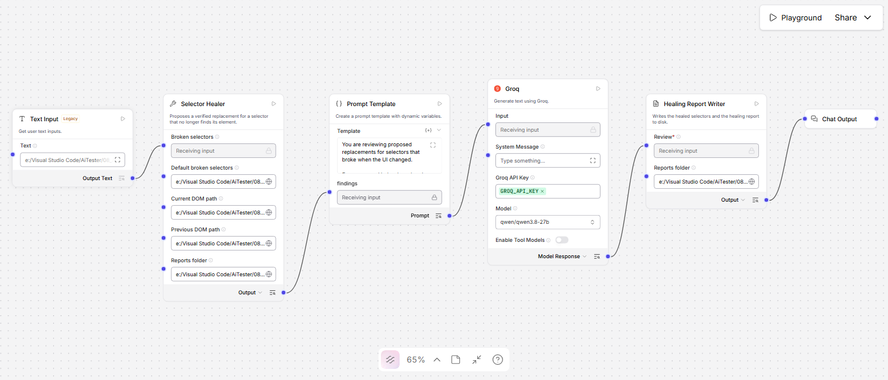
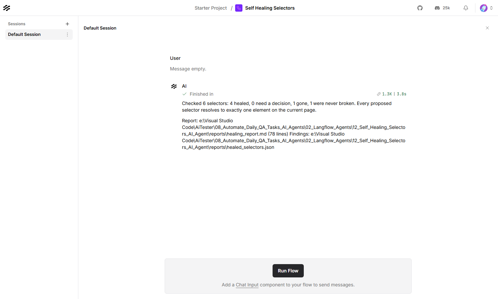

# Auto-Update Selectors (Self-Healing) — Langflow AI Agent

Takes selectors that stopped finding their elements and proposes replacements
that do — each one already run against the page and confirmed to resolve to
exactly one element.



| | |
|---|---|
| **Input** | Broken selectors, the current DOM, and optionally the DOM from when they worked |
| **Output** | `healing_report.md` and `healed_selectors.json` |
| **Decides in code** | Which element matches, whether the replacement is unique, whether to refuse |
| **Built with** | Langflow 1.12, Groq (`qwen/qwen3.8-27b`), BeautifulSoup + soupsieve |
| **Helpful for** | The maintenance tax after a design-system upgrade |

---

## What it produces

Six selectors from a checkout suite, against a page that was restyled:

| Was | Now | Via | Score |
|---|---|---|---:|
| `.btn-primary.checkout-submit` | `page.getByTestId('place-order')` | test id | 49 |
| `#summary > div:nth-child(4) > span.summary-row__value` | `page.getByTestId('order-total')` | test id | 91 |
| `.basket-item:nth-child(2) .basket-item__remove` | `page.getByRole('button', name='Remove USB-C cable')` | role and name | 82 |
| `.panel--payment .input--text` | `page.locator('#card-number')` | id | 94 |

…plus one refusal and one selector that was never broken:

- `//a[@class='link link--muted js-apply-gift']` — **gone.** The gift-card link
  was removed from the product. The test needs rewriting, not re-pointing.
- `#ship-post` — **never broken.** It still resolves. Saying so is more useful
  than quietly proposing a replacement nobody needed.

Then the model's section, which is given the one job code cannot do — deciding
whether the element found is the element the test *meant*:

> **Check before applying**
> `page.getByTestId('place-order')`: The match score is low (49/100) and the
> evidence is generic. Verify that the `place-order` test ID is actually
> attached to the primary submission button and not a secondary "Continue"
> button. If the ID is on the wrong button, the test will pass while clicking
> the wrong element.

**Nothing is proposed that has not been run against the page.** Candidates are
generated from the DOM, evaluated, and discarded unless they resolve to exactly
one element. That is a property of the pipeline, not a claim the model makes.

---

## Contents

| File | What it is |
|---|---|
| `Self_Healing_Selectors_langflow_flow.json` | The flow. Import this into Langflow |
| `selector_healer.py` | Finds the element, builds candidates, verifies and scores them |
| `healing_report_writer.py` | Composes the report and the replacement list |
| `test_self_healing_selectors.py` | Their tests — 156, no Langflow needed |
| `sample_dom/checkout_before.html` | The page when the suite passed |
| `sample_dom/checkout_after.html` | The same page after a design-system upgrade |
| `sample_dom/broken_selectors.txt` | Six selectors covering heal, refuse and no-op |
| `reports/` | Output — the report and the structured replacements |
| `plan.md` | Why it is built this way |

---

## Requirements

- **Langflow** running, normally at `http://127.0.0.1:7860`
- **A Groq API key** — free from [console.groq.com](https://console.groq.com)
- `beautifulsoup4` and `soupsieve`, both already present in a Langflow install

---

## Setup

**1. Store the Groq key in Langflow.** Settings → Global Variables → Add New.
Name it exactly `GROQ_API_KEY`, type **Credential**.

**2. Import the flow.** New Flow → Import →
`Self_Healing_Selectors_langflow_flow.json`.

**3. Set the reports folder on both nodes.** The **Selector Healer** and the
**Healing Report Writer** each have a **Reports folder** field and they must
point at the same place — the healer writes `healed_selectors.json` there and
the writer reads it back:

```
C:/Users/you/AiTester/08_Automate_Daily_QA_Tasks_AI_Agents/02_Langflow_Agents/12_Self_Healing_Selectors_AI_Agent/reports
```

**4. Point the paths at your own files.** On the **Selector Healer**: **Default
broken selectors**, **Current DOM path**, and **Previous DOM path**. All three
hold absolute paths from the machine the flow was built on.

---

## Usage

Put the path to your selector list in the **Text Input** node, then
**Playground → Run Flow**.



### The four outcomes

| Outcome | What it means |
|---|---|
| **healed** | One element matched well and a unique selector for it was verified |
| **ambiguous** | Several elements matched equally well, or no unique selector exists for the one that did. Reported rather than guessed |
| **gone** | Nothing in the new page resembles the old element. The feature was removed |
| **not_broken** | The selector still resolves. Nothing to do |

### Getting the DOM

Save `document.documentElement.outerHTML` from the page, or in Playwright:

```ts
await page.content();            // whole page
await page.locator('main').innerHTML();  // just the region under test
```

The **previous DOM** is optional but does most of the work. With it the healer
knows what the element *was* — its text, role, attributes and neighbours — and
matches that identity in the new page. Without it, identity has to be inferred
from the selector string, which for something like
`.basket-item:nth-child(2) .basket-item__remove` is almost nothing. Run the
samples with the Previous DOM path cleared and the four heals become refusals:
that is the agent declining to guess rather than failing.

### What it will and will not emit

Proposals climb a ladder, best rung first:

1. `data-testid` (and `data-test`, `data-qa`, `data-cy`)
2. an authored `id`
3. role + accessible name
4. label
5. visible text
6. a stable attribute — `name`, `href`, `placeholder`, `alt`
7. CSS scoped to the nearest authored id

It will **never** emit absolute XPath, `nth-child`, or a selector built from
styling classes, because agent 09 in this same repo flags exactly those as
anti-patterns. Healing onto one buys a green run today and the same break next
sprint. Framework-generated ids (`:r3:`, `mui-1234`, `headlessui-…`) are
rejected for the same reason.

Hidden elements are not healing targets either — `hidden`, `aria-hidden="true"`,
`display:none` and `<input type="hidden">`, inherited down the subtree. A
component rendered twice for two breakpoints offers two identical matches, and
the hidden one would resolve, verify, and then time out for ever.

### Tuning

| Field | Default | What it does |
|---|---|---|
| **Heal threshold** | 45 | Below this score, the element is reported gone |
| **Ambiguity margin** | 12 | If the best beats the runner-up by less, it is reported ambiguous |

Raise the threshold to make it more willing to refuse; raise the margin to make
it more suspicious of close calls.

### From the API

```bash
curl -X POST "http://127.0.0.1:7860/api/v1/run/<flow-id>?stream=false" \
  -H "Content-Type: application/json" \
  -H "x-api-key: <langflow-key>" \
  -d '{
        "output_type": "chat",
        "input_type": "text",
        "input_value": "C:/path/to/broken_selectors.txt"
      }'
```

### Running the component tests

No Langflow and no network needed:

```bash
09_LangFlow/.venv/Scripts/python.exe test_self_healing_selectors.py
```

---

## Troubleshooting

| What you see | What to do |
|---|---|
| `No broken selectors were given` | Set **Default broken selectors** — the Playground sends an empty input |
| `No current DOM reached this component` | Set **Current DOM path**, or paste the HTML |
| Everything comes back `gone` | No previous DOM, and the selectors carry no identity of their own — supply the previous snapshot |
| A heal you disagree with | Check its score. Under about 60 means the evidence was thin, which is what the model's "check before applying" section is for |
| `ambiguous: it needs a test id` | Correct diagnosis — nothing on the page distinguishes that element |
| `No healed_selectors.json in …` | The two Reports folder fields do not match — setup step 3 |
| `Invalid API key` | The global variable must be named exactly `GROQ_API_KEY` |
