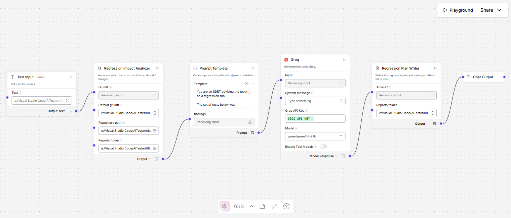
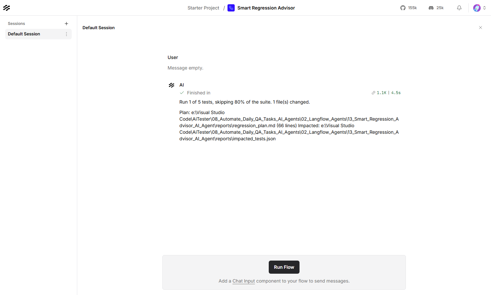

# Smart Regression Advisor — Langflow AI Agent

Reads a git diff, works out which tests can actually reach the changed code, and
recommends running those — or says plainly when the change cannot be narrowed
safely and the whole suite should run.



| | |
|---|---|
| **Input** | A git diff, and the repository it applies to |
| **Output** | `regression_plan.md` and `impacted_tests.json`, plus a runnable command |
| **Decides in code** | Which tests are impacted, and when no subset is safe |
| **Built with** | Langflow 1.12, Groq (`qwen/qwen3.8-27b`) |
| **Helpful for** | A regression cycle that runs everything because nobody can prove what to skip |

---

## What it produces

Six sample diffs against the sample repository, and the six different answers
they deserve:

| Diff | Verdict |
|---|---|
| A change to `src/utils/money.ts` | **1 of 5 tests** — 80% skipped |
| A change to the shared `src/utils/api.ts` | **3 of 5 tests** — reached through three page objects |
| A `package-lock.json` bump | **Whole suite** — nothing imports a lockfile |
| A change to `config.properties` | **Whole suite** — read by name at runtime, so no edge exists |
| A comment-only change | **No tests** — the change is ignored entirely |
| A change to `LoginPage.java` | **1 of 5 tests** — the one test that names the class |

Every selected test carries the path it was reached by, so the subset can be
checked rather than trusted:

| Tier | Test | Reached from | Hops |
|---|---|---|---:|
| must_run | `tests/checkout.spec.ts` | `src/utils/money.ts` | 1 |

Then the model orders the work and weighs the risk. On the `money.ts` change it
argued *against* its own subset, which is the behaviour worth having:

> **The Trade**
> …For this specific change, the cost is larger. Because `money.ts` is a
> foundational utility, its failure modes are often subtle (e.g. floating-point
> precision errors) that might not trigger an immediate assertion failure in
> `checkout.spec.ts`… The subset is too narrow to safely certify a change to a
> core financial utility.

**The model never chooses the tests.** The set is computed from the import
graph; the model orders it and assesses the risk of skipping the rest.

---

## Contents

| File | What it is |
|---|---|
| `Smart_Regression_Advisor_langflow_flow.json` | The flow. Import this into Langflow |
| `regression_impact_analyzer.py` | Parses the diff, builds the graph, selects the tests |
| `regression_plan_writer.py` | Composes the plan and the runnable command |
| `test_regression_advisor.py` | Their tests — 111, no Langflow needed |
| `sample_repo/` | A small TypeScript + Java suite with a real import graph |
| `sample_diffs/` | Six diffs, each deserving a different answer |
| `reports/` | Output — the plan and the impacted-test list |
| `plan.md` | Why it is built this way |

---

## Requirements

- **Langflow** running, normally at `http://127.0.0.1:7860`
- **A Groq API key** — free from [console.groq.com](https://console.groq.com)

---

## Setup

**1. Store the Groq key in Langflow.** Settings → Global Variables → Add New.
Name it exactly `GROQ_API_KEY`, type **Credential**.

**2. Import the flow.** New Flow → Import →
`Smart_Regression_Advisor_langflow_flow.json`.

**3. Set the reports folder on both nodes.** The **Regression Impact Analyzer**
and the **Regression Plan Writer** each have a **Reports folder** field and they
must match — the analyzer writes `impacted_tests.json` there and the writer
reads it back.

**4. Point it at your repository.** On the analyzer, set **Repository path** to
your checkout and **Default git diff** to the diff you want analysed.

---

## Usage

Produce a diff, put its path in the **Text Input** node, then
**Playground → Run Flow**.

```bash
git diff main...HEAD > /tmp/change.diff          # a branch
git diff HEAD~1 > /tmp/change.diff               # the last commit
```



### The tiers

| Tier | Rule |
|---|---|
| **must_run** | The test is the changed file, or imports it directly |
| **should_run** | The test reaches it transitively, through a page object or helper |
| **full_suite** | An escalation fired — no subset is defensible |

### What forces the whole suite

A subset is a promise that the skipped tests could not have caught the change.
Some changes cannot be modelled as an edge in an import graph at all, and for
those the honest answer is everything:

| Rule | Examples |
|---|---|
| `lockfile` | `package-lock.json`, `pnpm-lock.yaml`, `yarn.lock` |
| `dependency_manifest` | `package.json`, `pom.xml`, `build.gradle` |
| `resolution_config` | `tsconfig.json`, `vite.config.ts`, `babel.config.js` |
| `test_runner_config` | `playwright.config.ts`, `jest.config.js`, `testng.xml` |
| `global_setup` | `global-setup.ts`, `conftest.py`, `BaseTest`, `BasePage` |
| `ci_config` | `.github/workflows/*`, `Jenkinsfile`, `.gitlab-ci.yml` |
| `runtime_resource` | `.properties`, `.env`, `.feature`, `.sql` — read by name, never imported |
| `test_fixture_data` | `fixtures/`, `testdata/`, `__snapshots__/` |
| `large_diff` | More files than the threshold — narrowing buys little and risks much |
| `unreadable_diff` | Binary patches, submodule pointers, merge diffs |
| `file_not_in_repo` | A changed path the repository does not contain |

### What it understands

| | |
|---|---|
| **TypeScript** | `import`, `export … from`, `require()`, dynamic `import()`, `tsconfig` path aliases, barrel `index.ts` files, `.js` specifiers resolving to `.ts` |
| **Java** | `import`, wildcard imports, and same-package classes **that the file actually names** |
| **Tests** | `*.spec.ts`, `*.test.ts`, `tests/`, `e2e/`, `__tests__/`, `*Test.java`, `*IT.java`, `src/test/java` |

### From the API

```bash
curl -X POST "http://127.0.0.1:7860/api/v1/run/<flow-id>?stream=false" \
  -H "Content-Type: application/json" \
  -H "x-api-key: <langflow-key>" \
  -d '{
        "output_type": "chat",
        "input_type": "text",
        "input_value": "C:/path/to/change.diff"
      }'
```

### Running the component tests

```bash
09_LangFlow/.venv/Scripts/python.exe test_regression_advisor.py
```

---

## Before you trust a subset

Every plan ends with a list of what the analysis cannot see, and it is the most
important section in the document. A static import graph does not know about
selectors matching markup, HTTP boundaries, database migrations, values read by
name at runtime, Cucumber glue bound by regular expression, shared state between
tests, or timing. Any one of those can mean a skipped test would have caught the
change.

Use it to run the likely-affected tests *first* and get a signal in seconds. Use
it to skip the rest only when the blind spots do not apply to the change in
front of you.

---

## Troubleshooting

| What you see | What to do |
|---|---|
| `No diff reached this component` | Set **Default git diff** — the Playground sends an empty input |
| `No readable repository path` | Set **Repository path**; the graph is built from the checkout |
| `No changed files were found in the diff` | Not a unified diff — use `git diff`, not a summary |
| Everything escalates to the full suite | Expected for lockfiles and config; check which rule fired in the plan |
| `No TypeScript or Java source files under …` | The repository path is wrong, or the code is in a language this does not model |
| Selects nothing for a real change | Check the blind-spot list — the coupling may be one it cannot see |
| `No impacted_tests.json in …` | The two Reports folder fields do not match — setup step 3 |
| `Invalid API key` | The global variable must be named exactly `GROQ_API_KEY` |
