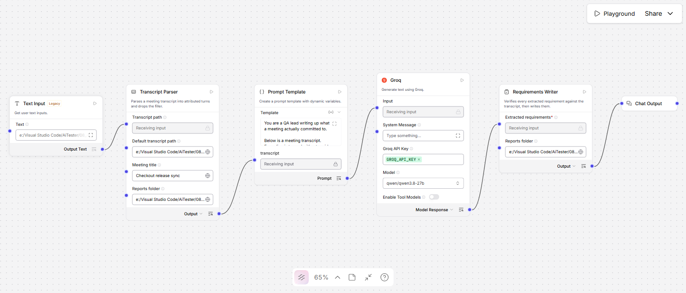
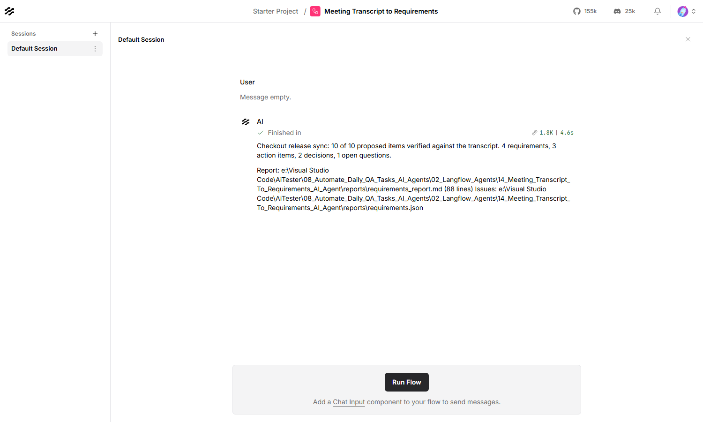

# Meeting Transcript to Requirements — Langflow AI Agent

Reads a Zoom or Teams transcript and turns what was agreed into Jira-ready
requirements — and throws away every item it cannot find somebody actually
saying.



| | |
|---|---|
| **Input** | A meeting transcript — Zoom WEBVTT, Teams export, or `Name: text` |
| **Output** | `requirements.json` (Jira payloads) and `requirements_report.md` |
| **Decides in code** | Who said it, when, and whether it was said at all |
| **Built with** | Langflow 1.12, Groq (`qwen/qwen3.8-27b`) |
| **Helpful for** | Verbal agreements that evaporate the moment the call ends |

---

## What it produces

From the 33-turn checkout release sync in this folder — of which **30% is
filler** that never reaches the model:

**Requirements (4)**

> **The guest checkout feature flag must default to off in production until legal sign-off is received.**
>
> > the flag has to default to off in production until legal sign off
>
> — Priya Sharma at 00:00:33.000 (T7)

**Action items (3)** — each attributed to whoever actually volunteered:
Mei Lin will raise the ticket to flip the flag, Raj Patel takes the tax line
item, Priya Sharma checks the tax rate with finance.

**Decisions (1)**

> **The payment retry feature is parked and not committed for the current sprint.**
>
> > Let's park it. Not committing to it today.

That last one is the distinction worth having. Someone *suggested* payment retry
and the group declined it — so it is recorded as a decision not to do it, not as
a requirement to do it.

### The part that makes it trustworthy

Every item carries a **quote**, and every quote is checked against the
transcript before the item is allowed through. An invented requirement has
nothing to quote, so it cannot survive.

Handed six items — three real and three invented in plausible language — the
writer keeps three:

| Proposed | Outcome |
|---|---|
| Guest checkout flag defaults to off | verified |
| Order total shows tax as a separate line | verified |
| Regression suite runs on every pull request | verified |
| Add two-factor authentication to checkout | **rejected** — quote does not appear in the transcript |
| Migrate the payment provider to Stripe | **rejected** — quote does not appear in the transcript |
| *(an item with no quote at all)* | **rejected** — nothing to check it against |

Rejections are printed in the report, not dropped silently. A filter you cannot
see the output of is indistinguishable from one that has stopped working.

### A meeting that agreed nothing

`coffee_catchup.txt` is eleven turns of small talk. It produces **zero
requirements**, and the report says so in as many words rather than
manufacturing a list to look useful.

---

## Contents

| File | What it is |
|---|---|
| `Meeting_Transcript_To_Requirements_langflow_flow.json` | The flow. Import this into Langflow |
| `transcript_parser.py` | Parses the transcript into attributed turns, drops filler |
| `requirements_writer.py` | Verifies every quote, then writes the report and the Jira payloads |
| `test_meeting_to_requirements.py` | Their tests — 108, no Langflow needed |
| `sample_transcripts/checkout_release_sync.vtt` | Zoom WEBVTT, 33 turns, 8 real items |
| `sample_transcripts/regression_triage_weekly.txt` | Teams export, 19 turns |
| `sample_transcripts/coffee_catchup.txt` | A meeting that agreed nothing |
| `reports/` | Output — the report and the Jira-ready issues |
| `plan.md` | Why it is built this way |

---

## Requirements

- **Langflow** running, normally at `http://127.0.0.1:7860`
- **A Groq API key** — free from [console.groq.com](https://console.groq.com)

---

## Setup

**1. Store the Groq key in Langflow.** Settings → Global Variables → Add New.
Name it exactly `GROQ_API_KEY`, type **Credential**.

**2. Import the flow.** New Flow → Import →
`Meeting_Transcript_To_Requirements_langflow_flow.json`.

**3. Set the reports folder on both nodes.** The **Transcript Parser** and the
**Requirements Writer** must point at the same folder — the parser writes
`transcript_turns.json` there and the writer reads it back to check quotes
against. If they differ, nothing can be verified.

**4. Point it at your transcript.** On the parser, set **Default transcript
path** and **Meeting title**.

---

## Usage

Put the transcript path in the **Text Input** node, then
**Playground → Run Flow**.



### Getting a transcript

| Platform | Where |
|---|---|
| **Zoom** | Recordings → the `.vtt` file beside the recording |
| **Teams** | Open the recording → Transcript → Download as `.txt` or `.vtt` |
| **Anything else** | A plain `Name: what they said` text file works |

### The four categories

| Category | What it means | Jira type |
|---|---|---|
| `requirement` | Something the product must now do | Story |
| `action_item` | Something a named person agreed to do | Task |
| `decision` | A choice the group settled — including not to do something | Task |
| `open_question` | Raised out loud and explicitly left unresolved | Task |

### Tuning

| Field | Default | What it does |
|---|---|---|
| **Minimum words in a turn** | 4 | Shorter turns carry no commitment and are dropped |
| **Maximum characters sent** | 12000 | A longer transcript is cut — and the cut is reported |
| **Minimum words in a quote** | 4 | Below this a quote matches too easily to prove anything |
| **Drop filler turns** | on | Off sends everything, which is slower and rarely better |

### From the API

```bash
curl -X POST "http://127.0.0.1:7860/api/v1/run/<flow-id>?stream=false" \
  -H "Content-Type: application/json" \
  -H "x-api-key: <langflow-key>" \
  -d '{
        "output_type": "chat",
        "input_type": "text",
        "input_value": "C:/path/to/meeting.vtt"
      }'
```

### Running the component tests

```bash
09_LangFlow/.venv/Scripts/python.exe test_meeting_to_requirements.py
```

---

## Before you raise the tickets

`requirements.json` is a set of Jira payloads, not a set of created issues —
**nothing is sent anywhere.** Review it, then post it with whatever you normally
use.

Two limits worth knowing. The agent can prove a line was *said*; it cannot prove
it was *meant* as a commitment — a firm "we will" and a thinking-aloud "we
could" look alike in text, which is why every item ships with its quote attached.
And a transcript longer than the budget is cut, with the unreviewed turns named
in the report: if you see that warning, the meeting is not fully covered.

---

## Troubleshooting

| What you see | What to do |
|---|---|
| `No transcript reached this component` | Set **Default transcript path** — the Playground sends an empty input |
| `No speaker turns were found` | The format is not one of the three; convert to `Name: text` |
| `Every one of the N turns is filler` | Correct for a social call — there is nothing to extract |
| Everything is rejected | The model paraphrased instead of quoting; that is the check working |
| `No transcript_turns.json in …` | The two Reports folder fields do not match — setup step 3 |
| `The model's reply was not JSON` | Raise **Max Tokens** on Groq; a truncated reply is not valid JSON |
| `WARNING: N turns were never reviewed` | The transcript exceeded the budget — split it or raise the limit |
| `Invalid API key` | The global variable must be named exactly `GROQ_API_KEY` |
