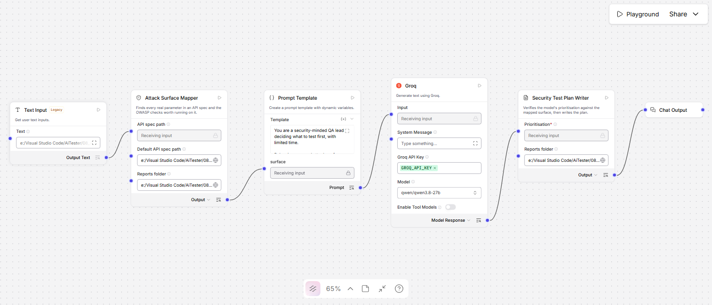
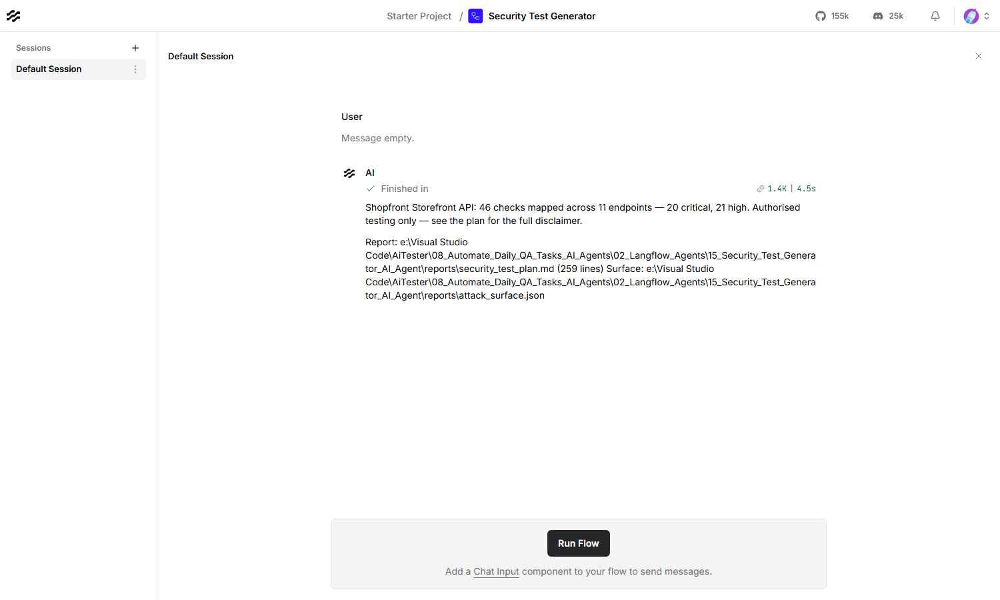

# Security Test Generator — Langflow AI Agent

Reads an API spec and maps the OWASP injection and access-control checks worth
running against it — every check targeting a parameter that is actually in the
spec, every payload the standard published detection probe for its class.

> **Authorised testing only.** This generates detection probes for an API you
> own or have explicit written permission to test — your own staging or QA
> environment. Running them against a system you do not have permission to
> test is unauthorised access in most jurisdictions, regardless of intent.
> Every report this agent produces opens with this same line.



| | |
|---|---|
| **Input** | An OpenAPI/Swagger spec (JSON or YAML), or a plain endpoint list |
| **Output** | `security_test_plan.md` and `attack_surface.json` |
| **Decides in code** | Which parameters exist, which attack classes apply, which payloads to send |
| **Built with** | Langflow 1.12, Groq (`qwen/qwen3.8-27b`) |
| **Helpful for** | A functional QA who needs to run basic security checks and has never had to design them |

---

## What it produces

The sample storefront spec — 11 endpoints, 19 parameters — maps to **46
checks**, 20 of them critical:

| | |
|---|---|
| `GET /users/{userId}` | SQL injection, **BOLA (IDOR)** |
| `GET /files/download?path=` | SQL injection, XSS, **path traversal** |
| `POST /integrations/webhook` (`url`) | SQL injection, XSS, **SSRF**, open redirect, CRLF injection |
| `POST /login` (`username`, `password`) | SQL injection, NoSQL injection, XSS, LDAP injection |
| `POST /catalog/import` (XML body) | **XML external entity (XXE)** |
| `GET /status` | *(no parameters — nothing to check)* |

Every row is real targeting, not a template: SSRF and open redirect only ever
land on a parameter shaped like a URL, path traversal only on one shaped like a
file path, BOLA only on an id a path or query actually carries.

Then the model's read on where to spend limited time:

> **1. Run First: BOLA on ID Parameters**
> Prioritize the Broken Object-Level Authorization (IDOR) checks on
> `GET /orders/{orderId}`, `GET /products/{productId}`, and
> `GET /users/{userId}`. Unlike XSS, which requires user interaction to
> exploit, a BOLA flaw allows immediate, silent data exfiltration…
>
> **3. Structural Risk: Universal SQLi Exposure**
> …every injectable parameter across all 10 vulnerable endpoints is flagged
> for SQL injection. This suggests the API lacks a consistent, parameterized
> query layer — this is not an isolated bug but a fundamental architectural
> weakness.

**The model never chooses a payload or names a parameter.** It is handed the
finished attack surface and asked which of the checks *already found* are worth
the first hour. Anything it names that is not in the mapped surface is dropped.

---

## Contents

| File | What it is |
|---|---|
| `Security_Test_Generator_langflow_flow.json` | The flow. Import this into Langflow |
| `attack_surface_mapper.py` | Parses the spec, maps every parameter to its applicable checks |
| `security_plan_writer.py` | Verifies the model stayed inside the mapped surface, writes the plan |
| `test_security_test_generator.py` | Their tests — 139, no Langflow needed |
| `sample_apis/shopfront_openapi.json` | A storefront API touching every attack class |
| `sample_apis/support_desk_openapi.yaml` | A smaller spec, proving YAML detection |
| `sample_apis/endpoints.txt` | A plain endpoint list — no OpenAPI needed |
| `reports/` | Output — the plan and the raw attack surface |
| `plan.md` | Why it is built this way |

---

## Requirements

- **Langflow** running, normally at `http://127.0.0.1:7860`
- **A Groq API key** — free from [console.groq.com](https://console.groq.com)
- `pyyaml`, already present in a Langflow install, for the YAML spec format

---

## Setup

**1. Store the Groq key in Langflow.** Settings → Global Variables → Add New.
Name it exactly `GROQ_API_KEY`, type **Credential**.

**2. Import the flow.** New Flow → Import →
`Security_Test_Generator_langflow_flow.json`.

**3. Set the reports folder on both nodes.** The **Attack Surface Mapper** and
the **Security Test Plan Writer** must point at the same folder — the mapper
writes `attack_surface.json` there and the writer reads it back.

**4. Point it at your own spec.** Set **Default API spec path** on the mapper
to an OpenAPI file from **your own staging environment**.

---

## Usage

Put the spec path in the **Text Input** node, then **Playground → Run Flow**.



### The attack classes

| Class | Targets a parameter shaped like… | Severity |
|---|---|---|
| SQL injection | any string or integer input | critical |
| NoSQL injection | an auth-context field | high |
| Reflected XSS | any string reflected in a response | high |
| OS command injection | `host`, `ping`, `cmd`, `exec`, `dns`… | critical |
| Path traversal | `file`, `path`, `dir`, `download`… | high |
| SSRF | `url`, `webhook`, `callback`, `proxy`, `avatar`… | high |
| Open redirect | `redirect`, `next`, `return`, `goto`… | medium |
| SSTI | `template`, `subject`, `message`, `display`… | high |
| HTTP header / CRLF injection | a header, or a redirect-shaped field | medium |
| LDAP injection | a login-context user/account field | high |
| XXE | an XML request body | high |
| **BOLA (IDOR)** | a path or query id | critical |

BOLA is not injection — it is an access-control check — and is included because
it is the top risk in the OWASP API Security Top 10. Turn it off with
**Include access-control checks** if you want injection-only output.

### From the API

```bash
curl -X POST "http://127.0.0.1:7860/api/v1/run/<flow-id>?stream=false" \
  -H "Content-Type: application/json" \
  -H "x-api-key: <langflow-key>" \
  -d '{
        "output_type": "chat",
        "input_type": "text",
        "input_value": "C:/path/to/your/openapi.json"
      }'
```

### Running the component tests

```bash
09_LangFlow/.venv/Scripts/python.exe test_security_test_generator.py
```

---

## Before you run any of these

This is a **detection** tool. Every payload is the standard OWASP-published
probe for its class — a scanner sends the same strings — never a weaponised
exploit, never anything destructive. Nothing here writes, deletes, or corrupts
data by design; each payload's job is to prove a class of bug exists, not to
use it.

That does not make it safe to point anywhere. Run these only against an API you
own or have explicit written permission to test. And the plan is a starting
point, not a finished audit: it maps what the *shape* of the API suggests is
worth checking, it has not run anything itself, and it does not cover
business-logic flaws, authentication design, or rate limiting. Executing each
check and confirming the positive signal is still a human step.

---

## Troubleshooting

| What you see | What to do |
|---|---|
| `No API spec reached this component` | Set **Default API spec path** — the Playground sends an empty input |
| `No endpoints were found` | The file is not OpenAPI JSON/YAML or a `METHOD /path` list |
| A parameter you expected is missing | Check its `$ref` resolves — the mapper follows local `#/components/...` refs only |
| Too many low-value checks | Turn off **Include access-control checks**, or read "Run Last/Skip" in the plan |
| `No attack_surface.json in …` | The two Reports folder fields do not match — setup step 3 |
| `Invalid API key` | The global variable must be named exactly `GROQ_API_KEY` |
