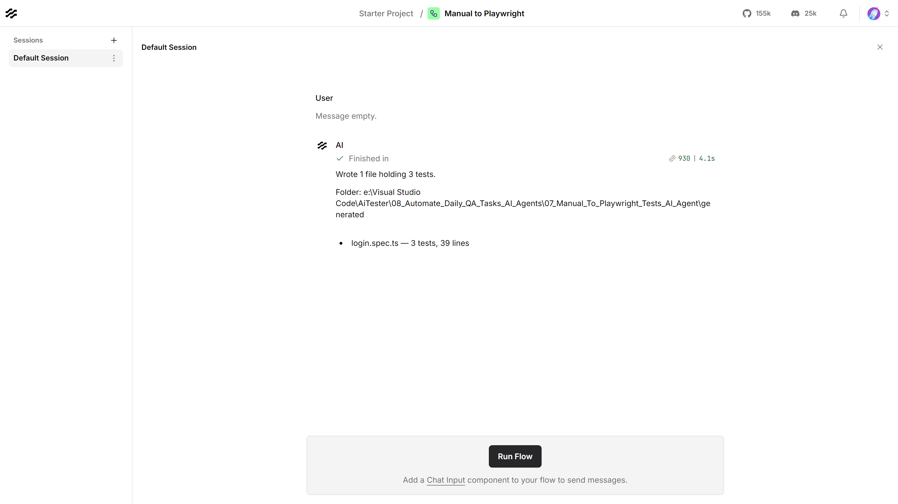

# Manual to Playwright Tests — Langflow AI Agent

Converts written manual test cases into Playwright test files in TypeScript, and
writes them to disk.


| | |
|---|---|
| **Input** | Manual test steps, as a tester wrote them |
| **Output** | A `.spec.ts` file per feature, written into `generated/` |
| **Built with** | Langflow 1.12, Groq (`qwen/qwen3.8-27b`) |
| **Helpful for** | Getting manual-only coverage into an automated suite |

---

## What it produces

A manual case:

```
TC-01 - Sign in with valid credentials
Precondition: A registered account exists with email ada@example.com
              and password Correct-Horse-9.
1. Open the login page.
2. Enter ada@example.com in the Email field.
3. Enter Correct-Horse-9 in the Password field.
4. Click the Sign in button.
Expected: The shopper lands on the account dashboard, and the account
          menu shows the name "Ada".
```

becomes:

```ts
test('sign in with valid credentials', async ({ page }) => {
  // TODO: Ensure a registered account exists with email ada@example.com
  //       and password Correct-Horse-9
  await page.goto('/login');
  await page.getByLabel('Email').fill('ada@example.com');
  await page.getByLabel('Password').fill('Correct-Horse-9');
  await page.getByRole('button', { name: 'Sign in' }).click();

  await expect(page).toHaveURL(/.*dashboard.*/);
  await expect(page.getByText('Ada')).toBeVisible();
});
```

Role- and label-based locators, web-first assertions, and a `// TODO` for any
precondition a browser cannot arrange for itself. Expectations are read as
expectations — "an order number in the form `SF-` followed by six digits" comes
back as a pattern rather than a literal:

```ts
await expect(page.getByText(/SF-\d{6}/)).toBeVisible();
```

What comes out is a **draft**. Selectors are inferred from the words in your
steps, so run it, fix what does not match your markup, and keep it.

---

## Contents

| File | What it is |
|---|---|
| `Manual_To_Playwright_langflow_flow.json` | The flow. Import this into Langflow |
| `playwright_spec_writer.py` | The custom component that writes the files |
| `test_playwright_spec_writer.py` | Its tests — 25, no Langflow needed |
| `manual_test_cases.md` | Ten sample manual cases across three features |
| `generated/` | Output — one `.spec.ts` per feature |
| `plan.md` | Why it is built this way |
| `*.png` | The flow, and the Playground after a run |

`playwright_spec_writer.py` is a **Langflow component**, not test code — Langflow
extends in Python. Everything this agent *generates* is TypeScript.

---

## Requirements

- **Langflow** running, normally at `http://127.0.0.1:7860`
- **A Groq API key** — free from [console.groq.com](https://console.groq.com)

---

## Setup

**1. Store the Groq key in Langflow.** Settings → Global Variables → Add New.
Name it exactly `GROQ_API_KEY`, type **Credential**. The flow looks it up by
name, so no key is stored in the JSON.

**2. Import the flow.** New Flow → Import → `Manual_To_Playwright_langflow_flow.json`.

**3. Set the output folder.** Click the **Playwright Spec Writer** node and set
**Output folder** to where you want the specs written:

```
C:/Users/you/AiTester/08_Automate_Daily_QA_Tasks_AI_Agents/07_Manual_To_Playwright_Tests_AI_Agent/generated
```

This is the one value that must change after cloning — it holds an absolute path
from the machine the flow was built on.

---

## Usage

Put your manual cases in the **Text Input** node, then **Playground → Run Flow**.



The Playground has a **Run Flow** button rather than a message box, because this
flow reads its steps from the Text Input node and not from a chat message.

Try it with what is already in the node — the Login cases from
`manual_test_cases.md`. Paste a different feature's cases to get a different
file; the name comes from the feature:

| Manual cases | Generated | Tests |
|---|---|---|
| Login, TC-01 to TC-03 | `login.spec.ts` | 3 |
| Cart, TC-04 to TC-06 | `cart.spec.ts` | 3 |
| Checkout, TC-07 to TC-10 | `checkout.spec.ts` | 4 |

**One run converts one feature.** Groq's free tier allows 1,000 output tokens a
minute, so **Max Tokens** is 900 — enough for three to five cases. Raise it on
the Groq node if you need more at once.

### From the API

```bash
curl -X POST "http://127.0.0.1:7860/api/v1/run/<flow-id>?stream=false" \
  -H "Content-Type: application/json" \
  -H "x-api-key: <langflow-key>" \
  -d '{
        "output_type": "chat",
        "input_type": "text",
        "input_value": "TC-01 - Sign in with valid credentials\n1. Open the login page.\n..."
      }'
```

`input_type: "text"` replaces what the Text Input node holds; `"chat"` uses the
steps already stored on it.

### Running the component tests

No Langflow and no network needed:

```bash
09_LangFlow/.venv/Scripts/python.exe test_playwright_spec_writer.py
```

---

## Writing cases it converts well

Any format works as long as a human could follow it: numbered steps and a line
saying what is expected. It converts better when the case names things the way
the UI does — "the **Sign in** button", "the Email field" — because those become
`getByRole('button', { name: 'Sign in' })` and `getByLabel('Email')`.

Give it no steps and it stops rather than writing a file. That is deliberate: a
model handed an empty brief returns fluent, well-formed, entirely invented tests,
which is the one output that would be worse than none.

---

## Troubleshooting

| What you see | What to do |
|---|---|
| `No manual steps reached this component` | The Text Input is empty, or the API call sent an empty `input_value` |
| `Only N characters of manual steps` | Paste the whole case, not just a title |
| `Set an output folder` | Setup step 3 |
| An error naming the Prompt Template and a `{ ... }` fragment | A literal `{` in the template is read as a variable — double it to `{{` |
| The reply is cut off mid-test | Raise **Max Tokens**, or convert fewer cases per run |
| `Invalid API key` | The global variable must be named exactly `GROQ_API_KEY` |
| Tests that do not match your cases | Check the steps actually reached the node — an empty input is the usual cause |
