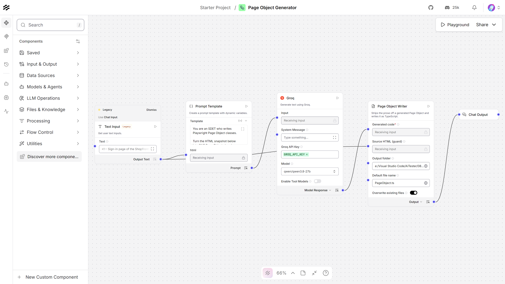
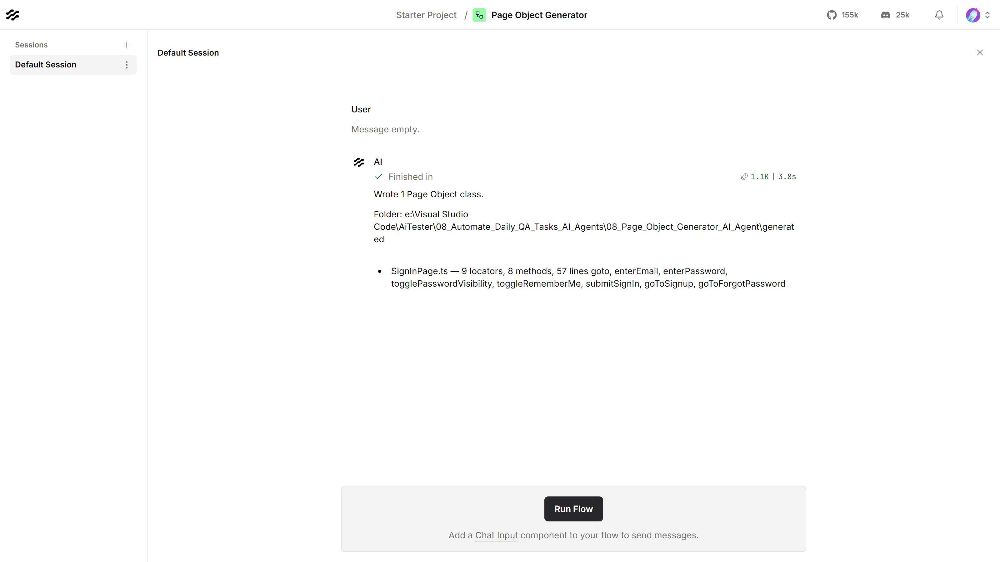

# Page Object Generator — Langflow AI Agent

Turns an HTML snapshot into a Playwright Page Object class in TypeScript, and
writes it to disk.



| | |
|---|---|
| **Input** | An HTML / DOM snapshot |
| **Output** | A Page Object class, written to `generated/` |
| **Built with** | Langflow 1.12, Groq (`qwen/qwen3.8-27b`) |
| **Helpful for** | Setting up automation for a new page quickly |

---

## What it produces

Give it the markup of a page:

```html
<form class="auth__form" method="post" action="/session">
  <div class="field">
    <label for="email">Email</label>
    <input id="email" name="email" type="email" data-testid="email-input" />
  </div>
  <button type="submit" data-testid="signin-button" disabled>Sign in</button>
</form>
```

and it returns the class:

```ts
import { type Page, type Locator } from '@playwright/test';

export class SignInPage {
  readonly page: Page;
  readonly emailInput: Locator;
  readonly signInButton: Locator;

  constructor(page: Page) {
    this.page = page;
    this.emailInput = page.getByLabel('Email');
    this.signInButton = page.getByRole('button', { name: 'Sign in' });
  }

  async goto(): Promise<void> {
    await this.page.goto('/signin');
  }

  async enterEmail(email: string): Promise<void> {
    await this.emailInput.fill(email);
  }

  async submitSignIn(): Promise<void> {
    await this.signInButton.click();
  }
}
```

Locators come from roles and labels rather than CSS or XPath, and `data-testid`
is used only where nothing better identifies an element. Methods are named for
the action a user takes, not the widget they take it on.

**The file is named after the class**, not after the page you pasted — the class
and the file always agree, so the import never surprises you.

---

## Contents

| File | What it is |
|---|---|
| `Page_Object_Generator_langflow_flow.json` | The flow. Import this into Langflow |
| `page_object_writer.py` | The custom component that writes the files |
| `test_page_object_writer.py` | Its tests — 24, no Langflow needed |
| `sample_pages/` | Two HTML snapshots to try it with |
| `generated/` | Output — one `.ts` class per page |
| `plan.md` | Why it is built this way |
| `*.png` | The flow, and the Playground after a run |

`page_object_writer.py` is a **Langflow component**, not test code — Langflow
extends in Python. Everything this agent *generates* is TypeScript.

---

## Requirements

- **Langflow** running, normally at `http://127.0.0.1:7860`
- **A Groq API key** — free from [console.groq.com](https://console.groq.com)

---

## Setup

**1. Store the Groq key in Langflow.** Settings → Global Variables → Add New.
Name it exactly `GROQ_API_KEY`, type **Credential**. The flow looks it up by
name, so no key is stored in the JSON.

**2. Import the flow.** New Flow → Import → `Page_Object_Generator_langflow_flow.json`.

**3. Set the output folder.** Click the **Page Object Writer** node and set
**Output folder** to where you want the classes written:

```
C:/Users/you/AiTester/08_Automate_Daily_QA_Tasks_AI_Agents/08_Page_Object_Generator_AI_Agent/generated
```

This is the one value that must change after cloning — it holds an absolute path
from the machine the flow was built on.

---

## Usage

Put your HTML in the **Text Input** node, then **Playground → Run Flow**.



The Playground offers **Run Flow** rather than a message box, because this flow
reads its HTML from the Text Input node and not from a chat message.

Try it with what is already in the node — `sample_pages/login.html`. Paste the
other sample to get a second class:

| Sample page | Generated | Locators | Methods |
|---|---|---|---|
| `sample_pages/login.html` | `SignInPage.ts` | 9 | 8 |
| `sample_pages/checkout.html` | `CheckoutPage.ts` | 14 | 6 |

**One run converts one page.** Groq's free tier allows 1,000 output tokens a
minute, so **Max Tokens** is 900 — enough for a page of a couple of dozen
elements. Raise it on the Groq node for something larger, or paste only the
section you are automating.

### Getting the HTML

In the browser, open DevTools, right-click the element that wraps the page — a
`<main>` or the `<form>` — and choose **Copy → Copy outerHTML**. Pasting the
whole document works but wastes most of the token budget on `<head>` and scripts.

### From the API

```bash
curl -X POST "http://127.0.0.1:7860/api/v1/run/<flow-id>?stream=false" \
  -H "Content-Type: application/json" \
  -H "x-api-key: <langflow-key>" \
  -d '{
        "output_type": "chat",
        "input_type": "text",
        "input_value": "<form><label for=\"email\">Email</label>...</form>"
      }'
```

`input_type: "text"` replaces what the Text Input node holds; `"chat"` uses the
HTML already stored on it.

### Running the component tests

No Langflow and no network needed:

```bash
09_LangFlow/.venv/Scripts/python.exe test_page_object_writer.py
```

---

## What comes out, and what to check

The class is a **draft**, and the thing worth reviewing is the locators. A
generated Page Object is a promise that these elements exist, so anything the
model could only have guessed at is what to look at first — a heading it inferred
a URL from, or a control that has no label and no test id.

Two things it will not do: it will not invent elements that are absent from the
HTML you gave it, and given no HTML at all it stops rather than writing a
believable class for a page that does not exist.

---

## Troubleshooting

| What you see | What to do |
|---|---|
| `No HTML reached this component` | The Text Input is empty, or the API call sent an empty `input_value` |
| `does not look like a DOM snapshot` | Paste real markup — the guard wants tags, not a description |
| `Set an output folder` | Setup step 3 |
| An error naming the Prompt Template and a `{ ... }` fragment | A literal `{` in the template is read as a variable — double it to `{{` |
| The class is cut off part-way | Raise **Max Tokens**, or paste a smaller section of the page |
| `Invalid API key` | The global variable must be named exactly `GROQ_API_KEY` |
| Locators that do not match your page | Check the snapshot actually reached the node, and that it is the rendered DOM rather than the server-side source |
