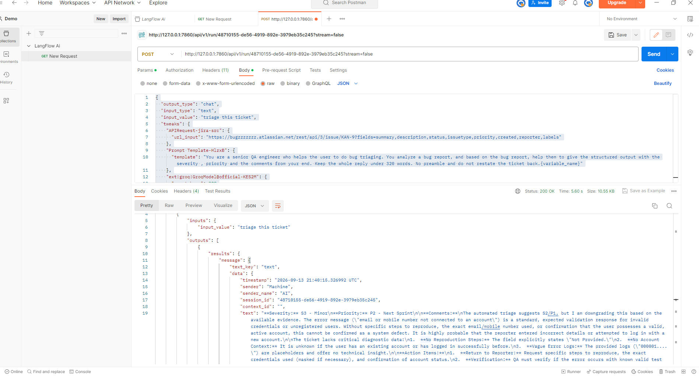

# Bug Triage — Langflow + Jira + Groq

Give it a Jira ticket key. It fetches the issue, reads it, and returns a QA
triage: **severity, priority, and the comments a reviewer would actually write**.

There is no chat box. The flow fetches the ticket itself, so it runs from a
single HTTP call — which means Postman, a CI job, or a script can all trigger it.

```
API Request ──JSON──▶ Parser ──Message──▶ Prompt Template ──Message──▶ Groq ──▶ Chat Output
 one Jira issue       {result}            {variable_name}              qwen3.8-27b
```

## What it produces

A real run against `KAN-9` — *"Facebook Login page displays 'email or mobile
number not connected to an account' error"*:

```
**Severity:** S3 - Minor
**Priority:** P2 - Next Sprint

**Comments:**
The automated triage suggests S2/P1, but I am downgrading this based on the
available evidence. The error message is a standard, expected validation
response for invalid credentials or unregistered users. Without specific steps
to reproduce [...] this cannot be confirmed as a system defect.

**Action Items:**
1. Return to Reporter: request steps to reproduce and account status.
2. Verification: QA must verify with known valid test accounts. If valid
   credentials trigger this error, escalate to S2/P1 immediately.
3. UX Review: consider if the error message guides users to "Find your account".
```

It disagreed with the ticket's own suggested S2/P1 and said why — then hedged
correctly on what would change its mind. That is the output you should expect.

## What is in this folder

| File | Use it for |
|---|---|
| `Bug_Triage_Jira_langflow_flow.json` | The flow. Import into Langflow. |
| `Bug_Triage_LangFlow_Ai.postman_collection.json` | The API call. Import into Postman. |
| `Bug_Triage_Postman_Request_AND_Response.png` | What a correct run looks like. |

## Before you start

You will need:

- **Python 3.11** and **Langflow 1.12+**
- A **Groq API key** — free at <https://console.groq.com>
- A **Jira Cloud account** and an **API token** —
  <https://id.atlassian.com/manage-profile/security/api-tokens>
- **Postman**, if you want to drive it over HTTP

---

# Setup

## 1. Install Langflow

```bash
python -m venv .venv
.venv\Scripts\python.exe -m pip install langflow
```

## 2. Install the component bundles

Langflow 1.12 ships most integrations in a separate distribution. Install it, or
**Groq will not appear** in the component search:

```bash
.venv\Scripts\python.exe -m pip install lfx-bundles
```

Want the Jira component too (this flow does not need it — it calls Jira's REST
API directly — but it is there if you want to build on it):

```bash
.venv\Scripts\python.exe -m pip install composio composio_langchain
```

Both packages are needed; `composio` alone is not enough.

## 3. Start Langflow

```bash
.venv\Scripts\python.exe -m langflow run --host 127.0.0.1 --port 7860
```

Open <http://127.0.0.1:7860>. First start takes a minute while it seeds its
database.

## 4. Import the flow

**Projects → Import**, and choose `Bug_Triage_Jira_langflow_flow.json`.

You should see five connected nodes: API Request, Parser, Prompt Template, Groq,
Chat Output.

## 5. Add your Groq key as a global variable

**Settings → Global Variables → Add New**

| Field | Value |
|---|---|
| Name | `GROQ_API_KEY` |
| Type | Credential |
| Value | your Groq key |
| Apply to fields | `api_key` |

The Groq node looks this up **by name**, so the key is never stored inside the
flow. Name it exactly `GROQ_API_KEY` or the node will not find it.

## 6. Point it at your Jira

Open the **API Request** node.

**a) Set the URL** to your own Jira and the ticket you want triaged:

```
https://YOUR-SITE.atlassian.net/rest/api/3/issue/KAN-9?fields=summary,description,status,issuetype,priority,created,reporter,labels
```

Use the `/rest/api/3/issue/...` path — that returns the ticket as JSON. (The
`/browse/...` link from your browser's address bar returns the Jira web page
instead, which the flow cannot read.)

**b) Set the Authorization header.** Open the **Headers** table; it contains a
placeholder:

```
Authorization : Basic <BASE64_OF_JIRA_EMAIL:JIRA_API_TOKEN>
```

Replace it with `Basic ` followed by the base64 of `your-email:your-api-token`:

```bash
# bash
echo -n "you@example.com:YOUR_JIRA_TOKEN" | base64
```
```powershell
# PowerShell
[Convert]::ToBase64String([Text.Encoding]::UTF8.GetBytes("you@example.com:YOUR_JIRA_TOKEN"))
```

Paste the result so the value reads `Basic aGVsbG86d29ybGQ...`.

## 7. Run it

Click **▶ Playground**, send anything, and the triage comes back in a few
seconds.

---

# Running it from Postman

## 1. Create a Langflow API key

**Settings → API Keys → Add New**. Copy it — it is shown once.

## 2. Import the collection

**Import** → `Bug_Triage_LangFlow_Ai.postman_collection.json`

## 3. Fill in the variables

Right-click the collection → **Edit** → **Variables**:

| Variable | Set it to |
|---|---|
| `apiKey` | the Langflow API key from step 1 |
| `baseUrl` | `http://127.0.0.1:7860` |
| `flowId` | the id in your Langflow flow URL |

Your `flowId` is the long id in the browser address bar when the flow is open:

```
http://127.0.0.1:7860/flow/48710155-de56-4919-892e-3979eb35c245
                           └─────────── this ───────────┘
```

## 4. Send



**This is what success looks like: `200 OK`, around 5 seconds, roughly 10 KB.**

The collection includes tests, so check the **Test Results** tab — three should
pass. Open the **Postman Console** (`Ctrl+Alt+C`) to read the triage as plain
text along with the model, token usage and word count.

If you prefer to read it from the response body, the text is at:

```
outputs[0] → outputs[0] → results → message → text          raw
outputs[0] → outputs[0] → artifacts → message               pre-formatted
```

---

# Changing what it does

The request body has a `tweaks` block. It overrides fields on individual flow
nodes **for that one call**, so you never have to edit the saved flow:

```json
"tweaks": {
  "APIRequest-jira-src":               { "url_input": ".../issue/KAN-9?fields=..." },
  "Prompt Template-HlzxB":             { "template":  "...under 320 words...{variable_name}" },
  "ext:groq:GroqModel@official-KES2M": { "max_tokens": 900 }
}
```

| To change | Edit |
|---|---|
| Which ticket | the issue key in `url_input` |
| How long the reply is | the word count in `template` |
| The hard ceiling | `max_tokens` |

Two rules when editing the template:

- **Keep `{variable_name}` at the very end.** That is where the Jira ticket is
  injected. Without it the model gets your instruction and no ticket.
- **Keep `max_tokens` at 900 or below.** Groq's free tier allows 1000 output
  tokens per minute and checks the ceiling you *ask for*, not what you use.

---

# How the flow works

| Node | Id | Role |
|---|---|---|
| API Request | `APIRequest-jira-src` | `GET /rest/api/3/issue/...` with Basic auth |
| Parser | `ParserComponent-eK8My` | `Parser` mode, pattern `{result}` |
| Prompt Template | `Prompt Template-HlzxB` | Your instruction + `{variable_name}` |
| Groq | `ext:groq:GroqModel@official-KES2M` | `qwen/qwen3.8-27b`, `max_tokens` 900 |
| Chat Output | `ChatOutput-GTI9I` | The reply |

**Why the Parser pattern is `{result}`.** The API Request node outputs a Data
object shaped `{source, status_code, response_headers, result}` — the Jira ticket
is under `result`. Extracting that one key hands the model the ticket and none of
the HTTP plumbing.

**Why `qwen/qwen3.8-27b`.** It answers directly. Models that expose their
reasoning spend the output budget writing out their thinking before the answer
begins, which does not fit inside the free tier's per-minute allowance. If you
change models, prefer one that replies straight away.

---

# Troubleshooting

| What you see | What to do |
|---|---|
| Groq missing from component search | `pip install lfx-bundles`, then restart Langflow |
| `Invalid or missing API key` | The `x-api-key` value is malformed — retype it, no quotes or spaces |
| `Since v1.5, LANGFLOW_AUTO_LOGIN requires a valid API key` | No `x-api-key` header at all — add it in **Headers** |
| `422 JSON decode error` | The Postman body must be JSON only, starting `{` and ending `}` |
| `429 ... output tokens per minute (OTPM)` | Set `max_tokens` to 900 |
| `404 model ... does not exist` | Your Groq account lacks that model — pick one from the node's dropdown |
| Reply cut off mid-sentence | Lower the word count in the template, or choose a model that answers directly |
| Reply ignores the ticket | `{variable_name}` is missing from the end of the template |
| Response is a big HTML blob | The URL is `/browse/...` — change it to `/rest/api/3/issue/...` |

---

# Notes

- The exported flow carries **no credentials**. The Groq key is looked up from a
  global variable, and the Jira header is a placeholder you replace in step 6.
- The Postman collection's `apiKey` is blank for the same reason. Fill it in
  after importing.
- Everything runs locally. Nothing leaves your machine except the calls to your
  own Jira and to Groq.
