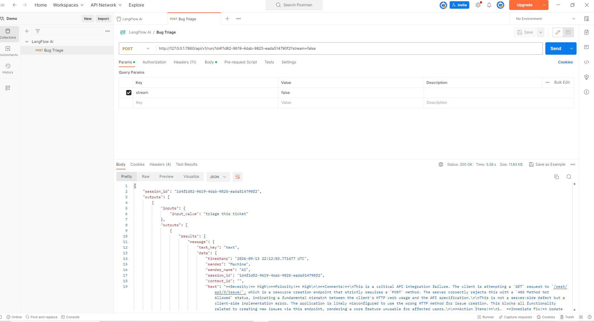

# Bug Triage AI Agent — Langflow + Jira + Groq

Type a Jira ticket key. Get back a QA triage of it: **severity, priority, and the
comments a reviewer would actually write.**

```
You type:  KAN-9

It replies:
  Severity: S3 - Minor        Priority: P3 - Low
  • Likely User Error: the error message states the credentials are not
    connected to an account — standard behaviour for invalid input.
  • Missing Reproduction Steps: impossible to verify as a genuine bug.
  • ...
```

The ticket key is a **parameter**, not a setting. Nothing is hardcoded — the flow
takes the key you give it, builds the Jira URL, fetches that issue and triages
it. Same flow, any ticket.

## How it works

```
Chat Input ──▶ Prompt Template ──▶ API Request ──▶ Parser ──▶ Prompt Template ──▶ Groq ──▶ Chat Output
  "KAN-9"      builds the URL      fetches Jira    {result}   adds the brief     triages
```

| Node | What it does |
|---|---|
| Chat Input | Takes the ticket key |
| Prompt Template (`MA3Du`) | `.../rest/api/3/issue/{issue-key}?fields=...` |
| API Request | `GET`s that URL with Basic auth |
| Parser | Pattern `{result}` — pulls the ticket out of the HTTP response |
| Prompt Template (`HlzxB`) | The triage brief + `{variable_name}` |
| Groq | `qwen/qwen3.8-27b`, `max_tokens` 900 |
| Chat Output | The reply |

Two details that matter if you edit it:

- **The first Prompt Template is a URL builder.** Its whole template is the Jira
  URL with `{issue-key}` in it. That is what turns a chat message into an API
  call.
- **`{variable_name}` must stay at the end of the second template.** That is
  where the fetched ticket is injected.

## What is in this folder

| File | Use it for |
|---|---|
| `Langflow_Bug Triage.json` | The flow. Import into Langflow. |
| `Bug_Triage_LangFlow_Ai.postman_collection.json` | The API call. Import into Postman. |
| `Bug_Triage_Postman.png` | The request and response side by side. |

## Before you start

- **Python 3.11** and **Langflow 1.12+**
- A **Groq API key** — free at <https://console.groq.com>
- A **Jira Cloud account** and an **API token** —
  <https://id.atlassian.com/manage-profile/security/api-tokens>
- **Postman**, to drive it over HTTP

---

# Setup

## 1. Install Langflow and the component bundles

```bash
python -m venv .venv
.venv\Scripts\python.exe -m pip install langflow lfx-bundles
```

`lfx-bundles` is required — Langflow 1.12 ships Groq in that separate
distribution, and without it **Groq will not appear** in the component search.

## 2. Start it

```bash
.venv\Scripts\python.exe -m langflow run --host 127.0.0.1 --port 7860
```

Open <http://127.0.0.1:7860>. The first start takes a minute while it builds its
database.

## 3. Import the flow

**Projects → Import** → `Langflow_Bug Triage.json`

You should see seven connected nodes, Chat Input on the left through to Chat
Output on the right.

## 4. Add your Groq key as a global variable

**Settings → Global Variables → Add New**

| Field | Value |
|---|---|
| Name | `GROQ_API_KEY` |
| Type | Credential |
| Value | your Groq key |
| Apply to fields | `api_key` |

The Groq node looks this up **by name**, so no key is stored inside the flow.
Name it exactly `GROQ_API_KEY`.

## 5. Point it at your Jira

**a) The URL template.** Open the **first Prompt Template** (the one wired to the
API Request) and replace the site with yours, keeping `{issue-key}`:

```
https://YOUR-SITE.atlassian.net/rest/api/3/issue/{issue-key}?fields=summary,description,status,issuetype,priority,created,reporter,labels
```

The `?fields=` list is worth keeping. Without it Jira returns every field on the
issue, including every empty custom field your project defines — on a real board
that is **38% more prompt** for nothing the triage reads:

```
without ?fields=   3480 input tokens
with    ?fields=   2168 input tokens
```

That headroom matters against Groq's 8000 input-tokens-per-minute ceiling. Add a
field to the list if your triage needs it.

**b) The credentials.** Open the **API Request** node → **Headers**. It carries a
placeholder:

```
Authorization : Basic <BASE64_OF_JIRA_EMAIL:JIRA_API_TOKEN>
```

Replace it with `Basic ` plus the base64 of `your-email:your-api-token`:

```bash
# bash
echo -n "you@example.com:YOUR_JIRA_TOKEN" | base64
```
```powershell
# PowerShell
[Convert]::ToBase64String([Text.Encoding]::UTF8.GetBytes("you@example.com:YOUR_JIRA_TOKEN"))
```

## 6. Try it

Click **▶ Playground** and send a ticket key — just the key, nothing else:

```
KAN-9
```

The triage comes back in a few seconds. Send a different key and you get a
different answer:

```
KAN-9   ->  Severity: S3 - Minor      Priority: P3 - Low
KAN-13  ->  Severity: S0 - Blocker    Priority: P0 - Immediate
```

---

# Running it from Postman

## 1. Create a Langflow API key

**Settings → API Keys → Add New**. Copy it — it is shown only once.

## 2. Import the collection

**Import** → `Bug_Triage_LangFlow_Ai.postman_collection.json`

## 3. Set the variables

Right-click the collection → **Edit** → **Variables**:

| Variable | Set it to |
|---|---|
| `apiKey` | the Langflow API key from step 1 |
| `ticket` | the ticket to triage, e.g. `KAN-9` |

Then check the URL in the request matches your flow id — the long id in your
browser's address bar when the flow is open:

```
http://127.0.0.1:7860/flow/1d4f1d82-9619-4dab-9825-eada514790f2
                           └─────────── this ───────────┘
```

## 4. Send



Expect **`200 OK` in roughly 5–8 seconds**, about 11 KB.

The collection ships with tests — check the **Test Results** tab, three should
pass. Open the **Postman Console** (`Ctrl+Alt+C`) to read the triage as plain
text with the model and token counts, instead of scrolling escaped JSON.

To read it from the response body:

```
outputs[0] → outputs[0] → results → message → text          raw
outputs[0] → outputs[0] → artifacts → message               pre-formatted
```

## The request body

```json
{
  "output_type": "chat",
  "input_type": "chat",
  "input_value": "{{ticket}}",
  "tweaks": {
    "Prompt Template-HlzxB":             { "template": "...{variable_name}" },
    "ext:groq:GroqModel@official-KES2M": { "max_tokens": 900 }
  }
}
```

**`input_type` must be `"chat"`.** This flow's entry point is a Chat Input node.
`"text"` looks for a Text Input instead, finds none, and the ticket key is
dropped — the URL then resolves to `/rest/api/3/issue/` with nothing on the end.
That is Jira's *create issue* endpoint, which rejects `GET` with `405`, and the
model will triage that error and still return `200 OK`. **Check the content, not
the status code.**

**`input_value` is the ticket key itself** — `KAN-9`, not a sentence.

`tweaks` overrides node fields for a single request, so you can change the brief
or the token ceiling without editing the saved flow:

| To change | Edit |
|---|---|
| Which ticket | the `ticket` collection variable |
| How long the reply is | the word count in the `template` tweak |
| The hard ceiling | `max_tokens` — keep it at 900 or below |

Groq's free tier allows 1000 output tokens per minute and checks the ceiling you
*ask for*, not what you use.

---

# Troubleshooting

| What you see | What to do |
|---|---|
| Groq missing from the component search | `pip install lfx-bundles`, restart Langflow |
| The reply is about a `405` or "Method Not Allowed" | `input_type` must be `"chat"`, and `input_value` the bare ticket key |
| The reply is about a `404` | The ticket key does not exist in your Jira project |
| `Invalid or missing API key` | The `x-api-key` value is malformed — retype it, no quotes or spaces |
| `Since v1.5, LANGFLOW_AUTO_LOGIN requires a valid API key` | No `x-api-key` header at all |
| `422 JSON decode error` | The Postman body must be JSON only, from `{` to `}` |
| `429 ... output tokens per minute (OTPM)` | Set `max_tokens` to 900 |
| `404 model ... does not exist` | Your Groq account lacks that model — pick one from the node's dropdown |
| Reply cut off mid-sentence | Lower the word count in the brief, or pick a model that answers directly |
| Reply ignores the ticket | `{variable_name}` is missing from the end of the second template |
| The response is a large HTML blob | The URL template is a `/browse/...` link — use `/rest/api/3/issue/{issue-key}` |

## Why the URL is `/rest/api/3/issue/`, not `/browse/`

The link in your browser's address bar (`.../browse/KAN-9`) serves the Jira web
**page** — about 1.4 MB of HTML whose ticket content is loaded afterwards by
JavaScript. The REST path returns the same issue as a few KB of JSON, which is
what the flow can actually read.

## Why this model

`qwen/qwen3.8-27b` answers directly. Models that expose their reasoning spend the
output budget writing out their thinking before the answer starts, which does not
fit inside the free tier's per-minute allowance. If you swap models, prefer one
that replies straight away.

---

# Notes

- The exported flow carries **no credentials**. The Groq key is looked up from a
  global variable; the Jira header is a placeholder you fill in at step 5.
- The Postman collection's `apiKey` is blank for the same reason.
- Everything runs locally. Nothing leaves your machine except the calls to your
  own Jira and to Groq.

## Compared with the static version

`../Bug Triage Static (Without Chat Trigger)` does the same job with the ticket
**hardcoded** into the API Request node — fewer moving parts, but you edit the
flow to change tickets. This version takes the key as input, so one flow serves
every ticket and it can be driven from a script, a form or CI.
