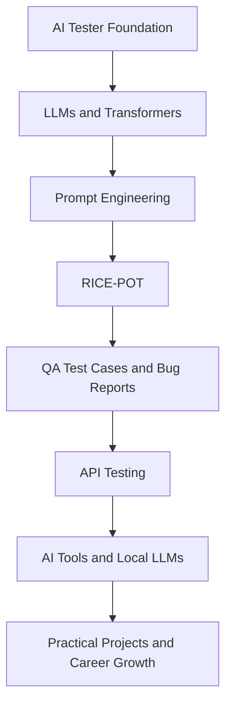
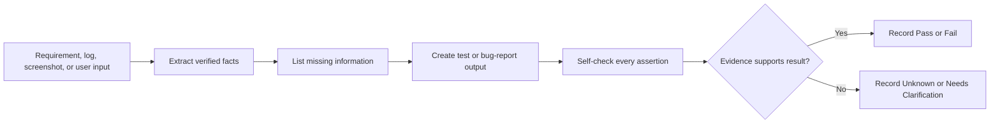
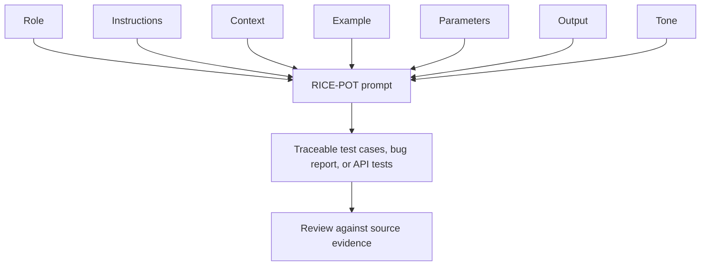
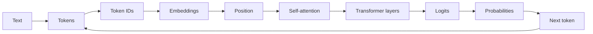

# AI Master Class Notes

Source: https://app.eraser.io/workspace/bhSR1i1RNhgFLX5vDxgp
Workspace: 4X Advanced AI Tester Blueprint
Last reviewed: 2026-08-23

These notes keep the useful learning content from the accessible workspace and organize dated class material chronologically. Course links, repeated access instructions, personal reminders, and promotional content are omitted.

## Quick Learning Map



> [!TIP]
> Study in this order: understand how the model works, learn how to write a precise prompt, apply anti-hallucination rules, then use the prompt patterns for QA work.

### One-Page Revision Path

| Learn First | Remember | Apply It To |
|---|---|---|
| Tokens, context, embeddings, attention | A model predicts likely next tokens | Understand model limitations |
| Specific prompts and constraints | Missing information must remain visible | Generate reliable QA outputs |
| RICE-POT structure | Role + Instructions + Context + Example + Parameters + Output + Tone | Build reusable prompts |
| Evidence-based QA | Facts are different from hypotheses | Write test cases and bug reports |
| API contracts and errors | Use documented schemas and status codes | Validate integrations |

## Visual Study Diagrams

### Evidence-Based QA Workflow



> [!IMPORTANT]
> Never turn a likely behavior into an expected result. Write `Insufficient information to determine.` when the source does not define it.

### Prompt To QA Artifact



### Transformer Generation At A Glance



### Sticky Notes

> [!NOTE]
> **Token:** a unit of text processed by the model. It may be a word, part of a word, punctuation, or a symbol.

> [!NOTE]
> **Hallucination:** unsupported or invented output presented as if it were true.

> [!NOTE]
> **Few-shot prompting:** provide one or more relevant examples to show the desired result.

> [!NOTE]
> **RICE-POT memory aid:** define who, what, context, example, limits, output, and tone.

> [!WARNING]
> Do not put passwords, API keys, access tokens, or private credentials into prompts, notes, source code, or Git commits.

# 2 AUGUST 2026

- CommandCode AI revisit and doubts session scheduled for 4 Aug.
- The notes associate this period with the start of the AI tester learning activities.

# 4 AUGUST 2026

- Doubts class and CommandCode AI session.
- Focus: revisit concepts and resolve questions.

# 7 AUGUST 2026

- Mastering Claude Code session with Claude 101 and certification material.
- The notes mention Claude Code commands and practical use of the tool.

# 8 AUGUST 2026

### Anti-Hallucination Rules

- Use only information explicitly provided in requirements, documentation, logs, screenshots, test data, or user input.
- Do not invent features, APIs, error codes, UI elements, or behavior.
- Do not assume typical system behavior.
- If information is missing, state: `Insufficient information to determine.`
- Every assertion must be traceable to the provided input.
- Label any inference explicitly as `Inference (low confidence)`.
- Keep output deterministic and repeatable.

### Required Process

1. Extract verifiable facts.
2. List missing or unknown information.
3. Generate output only from verified facts.
4. Perform a self-check for hallucinations and contradictions.

### QA Application

- Bug reports must not invent root causes, environments, error codes, or reproduction details.
- Test cases must not invent acceptance criteria, validation rules, API responses, or product behavior.
- Separate facts from hypotheses.
- Mark unclear items as `Needs clarification` or `[NEEDS CLARIFICATION]`.

### Anti-Hallucination Example: Bug Report

#### Evidence Provided

```text
Screenshot: Login button remains disabled after valid-looking input.
Browser: Chrome.
Environment: Staging.
```

#### Evidence-Based Output

```text
Title: Login button remains disabled after input
Environment: Staging, Chrome
Severity: Needs more information
Steps to Reproduce: [Not provided in evidence]
Expected Result: [UNKNOWN]
Actual Result: Login button remains disabled after valid-looking input.
Evidence: Screenshot
Root Cause: [UNKNOWN]
```

#### Why This Is Safe

- The actual result repeats only the supplied evidence.
- The root cause is not guessed.
- Severity is not assigned without demonstrated impact.
- Missing reproduction steps and expected behavior remain visible.

### Test Case Example: Evidence-Based Login Validation

| Test ID | Description | Preconditions | Steps | Expected Result | Priority |
|---|---|---|---|---|---|
| LOGIN-EX-001 | Verify the documented login control | Login page is available and the requirement identifies a login control | Open the page and locate the documented control | The documented control is available. | High |
| LOGIN-EX-002 | Validate an undocumented invalid-credential outcome | Invalid credentials and expected error behavior are documented | Enter the documented invalid values and submit | Use the exact documented error and navigation result. | High |
| LOGIN-EX-003 | Handle missing expected behavior | Login page is available but the requirement does not define the error result | Submit the supplied invalid data and capture evidence | `Insufficient information to determine.` until the expected behavior is documented. | Medium |

# 9 AUGUST 2026

### AI Tester Blueprint

- Foundation models are broad models trained on large datasets and adapted for multiple tasks.
- AI engineering applies software engineering practices to systems that use models.
- A language model predicts likely tokens using the available context.
- Context is the information available to the model when generating output.
- Tokens can represent words, word parts, punctuation, or symbols.
- Token count affects how much text a model can process.

### Transformer Generation Flow

1. Tokenize the input.
2. Convert tokens into token IDs.
3. Convert token IDs into embeddings.
4. Add positional information.
5. Create query, key, and value vectors.
6. Use self-attention to calculate token relevance.
7. Apply multi-head attention.
8. Process representations through a feed-forward network.
9. Apply residual connections and normalization.
10. Repeat through transformer layers.
11. Convert the final representation into logits.
12. Convert logits into probabilities with softmax.
13. Select the next token.
14. Repeat generation for following tokens.

### Decoding

- Greedy decoding selects the highest-probability token.
- Sampling selects from a probability distribution and can produce varied output.
- Temperature affects the concentration and diversity of token probabilities.

### RICE-POT Example: Salesforce Login Automation

| RICE-POT Element | Mentor Example |
|---|---|
| Role | QA automation tester with experience in IT and CRM projects such as Salesforce. |
| Instructions | Generate an enterprise-level Selenium, Java, Maven, and TestNG automation framework for the Salesforce login page. Automate valid and invalid login scenarios. |
| Context | Target: `https://login.salesforce.com/?locale=in`. The page includes username, password, submit, and Remember me functionality. |
| Example | Use Page Object Model with PageFactory, XPath locators, reusable action methods, and constructor initialization. |
| Parameters | External URLs and credentials are supplied separately. Use explicit waits and avoid `Thread.sleep()`. |
| Output | One Page Object file, two TestNG test scripts, and the Maven project files. |
| Tone | Technical, precise, and enterprise-grade. |

### Page Object Example: Salesforce Login

```java
public class LoginPage {
	@FindBy(xpath = "//input[@id='username']")
	WebElement username;

	@FindBy(xpath = "//input[@id='password']")
	WebElement password;

	@FindBy(xpath = "//input[@id='Login']")
	WebElement loginButton;

	public LoginPage(WebDriver driver) {
		PageFactory.initElements(driver, this);
	}

	public void doLogin(String user, String pass) {
		username.sendKeys(user);
		password.sendKeys(pass);
		loginButton.click();
	}
}
```

# 15 AUGUST 2026

- Holiday or no-class entry in the source notes.
- No technical study content recorded for this date.

# 22 AUGUST 2026

### Job Search And Resume Notes

- One resume should not automatically be assumed to fit every job portal or role.
- Resume content should be adapted to the target role and requirements.
- Resume validation and scoring should use explicit criteria rather than assumptions.
- The notes mention resume tools and job boards; their suitability should be evaluated independently.

# 23 AUGUST 2026

### LinkedIn And Professional Branding

- Review the main LinkedIn profile sections and keep them complete and consistent.
- Education and experience details should be accurate and verifiable.
- Recommendations can strengthen a profile when they are genuine and relevant.
- Profile photos, headlines, summaries, and featured work should present a professional and consistent identity.
- Maintain a practical timetable for job-search and profile-improvement activities.

# DATE NOT SPECIFIED: REFERENCE TOPICS AND MENTOR TEMPLATES

### Prompt Engineering

- Be specific about the task.
- Provide relevant context.
- Define the required output format.
- Set constraints and exclusions.
- Define the goal before writing the prompt.
- Gather and verify context.
- Choose a suitable prompting strategy.
- Structure the prompt and validate the result.

### Few-Shot Prompting

- Provide one or more examples when the desired output style or structure needs demonstration.
- Examples must be relevant and should not introduce unsupported requirements.

### RICE-POT

- Role: define the required expertise or perspective.
- Instructions: state the task and required actions.
- Context: provide the product, feature, evidence, or background.
- Example: show the desired format or style when useful.
- Parameters: define inputs, constraints, environment, and boundaries.
- Output: specify the exact deliverable.
- Tone: define the communication style.

### API Contract Testing Example

#### Input Specification

```text
API SCHEMA:
<<<
[PASTE JSON SCHEMA OR OPENAPI SPEC]
>>>
```

#### Output Structure

| Test ID | Response Type | Field | Expected Type | Required | Validation |
|---|---|---|---|---|---|
| API-CONTRACT-EX-001 | Success | [Documented field] | [Documented type] | [Documented requirement] | Compare the response with the supplied schema. |
| API-CONTRACT-EX-002 | Error | [Documented error field] | [Documented type] | [Documented requirement] | Compare the error response with the supplied schema. |

`[Documented field]`, `[Documented type]`, and the expected validation result must be replaced only with values from the supplied API specification.

### Bug Classification Example

```text
Severity: Needs more information
Priority: Needs more information
Justification: The supplied evidence does not demonstrate business impact, data loss, security impact, or workaround availability.
Missing Information: User impact, reproducibility, affected environment, frequency, and workaround.
```

### Prompt Output Example: Missing Information

```text
Verified Facts:
- The requirement identifies an email field.
- The requirement identifies a password field.

Missing / Unknown Information:
- The required error message is not provided.
- The successful-login destination is not provided.

Generated Output:
- Create cases for field presence and input submission.
- Mark the expected error and destination as unknown.

Self-Validation Check:
- No error message or redirect was invented.
```

### QA Prompt Templates

The workspace covers prompt patterns for test cases, bug reports, regression, security, and API testing. The reusable templates below preserve the important structure from the class material.

#### Basic Test-Case Generation

```text
ROLE: You are a Senior QA Engineer.

TASK: Generate [NUMBER] test cases for [FEATURE].

CONSTRAINTS:
- Use ONLY the provided requirements.
- Do NOT assume undocumented behavior.
- If information is missing, state: Not specified.

FORMAT:
| Test ID | Description | Preconditions | Steps | Expected Result | Priority |

REQUIREMENTS:
<<<
[PASTE REQUIREMENTS HERE]
>>>
```

#### PRD To Test Cases

```text
ROLE: You are a Senior QA Engineer.

TASK: Generate comprehensive test cases from this PRD.

COVERAGE:
- Functional happy path
- Negative scenarios
- Boundary values
- Edge cases

CONSTRAINTS:
- Use ONLY the PRD.
- Mark unclear items as Needs clarification.
- Do NOT invent error messages or codes.

FORMAT:
| TID | Category | Description | Preconditions | Steps | Expected | Priority |

PRD:
<<<
[PASTE PRD HERE]
>>>
```

#### Negative Test Cases

```text
ROLE: You are a QA Engineer focused on negative testing.

TASK: Generate negative test cases for [FEATURE].

FOCUS:
- Invalid inputs
- Boundary violations
- Missing required fields
- Unauthorized access
- Malformed data

CONSTRAINTS:
- Do NOT include happy-path scenarios.
- Each test must validate error handling.
- Include an expected error only when documented.

FORMAT:
| Test ID | Invalid Scenario | Input | Expected Error |

FEATURE REQUIREMENTS:
[PASTE REQUIREMENTS]
```

#### Security Test Cases

```text
ROLE: You are a Security QA Specialist.

TASK: Generate security-focused test cases for [FEATURE].

SECURITY AREAS:
- Input validation
- Authentication bypass
- Authorization
- Session management
- Sensitive-data exposure

CONSTRAINTS:
- Focus on applicable OWASP areas.
- Do NOT include actual secrets or tokens.
- Include expected secure behavior only when supported by requirements.

FORMAT:
| Test ID | Security Risk | Attack Vector | Expected Secure Behavior |

FEATURE:
[PASTE FEATURE DESCRIPTION]
```

#### Regression Test Suite

```text
ROLE: You are a QA Lead.

TASK: Design a regression test suite for [MODULE].

PRIORITIES:
1. Critical business flows
2. Previously failed areas
3. High-risk integrations
4. Core functionality

CONSTRAINTS:
- Focus on end-to-end scenarios.
- Include data setup requirements.
- Estimate execution time only when evidence is available.

FORMAT:
| Test ID | Scenario | Data Setup | Steps | Estimated Time | Priority |
```

### AI Bug-Report Templates

#### Bug Report From Evidence

```text
ROLE: You are a QA Engineer writing a bug report.

TASK: Generate a bug report based ONLY on the evidence provided.

CONSTRAINTS:
- Use ONLY information from screenshots, logs, and supplied requirements.
- Do NOT assume root cause.
- Do NOT invent error codes.
- Mark unknown information as [UNKNOWN].

FORMAT:
Title: [Brief description]
Environment: [From evidence or UNKNOWN]
Severity: [Based on demonstrated impact]
Steps to Reproduce: [From evidence]
Expected Result: [From requirements or UNKNOWN]
Actual Result: [From evidence]
Evidence: [Attachments, logs, screenshots]

EVIDENCE:
<<<
[PASTE SCREENSHOT DESCRIPTION OR LOGS]
>>>
```

#### Bug Classification

```text
ROLE: You are a QA Lead classifying bugs.

TASK: Classify this bug by severity and priority.

SEVERITY:
- Critical: crash, data loss, or security breach.
- High: major feature broken with no workaround.
- Medium: feature impaired with a workaround.
- Low: minor or cosmetic issue.

CONSTRAINTS:
- Base classification ONLY on supplied information.
- If impact is unclear, state: Needs more information.

FORMAT:
Severity: [Level]
Priority: [Level]
Justification: [Evidence-based reasoning]
Missing Information: [Required facts]

BUG DESCRIPTION:
<<<
[PASTE BUG DESCRIPTION]
>>>
```

#### Bug Analysis

```text
ROLE: You are a Senior QA Engineer analyzing a bug.

TASK: Analyze the bug using verified evidence.

ANALYSIS:
1. Identify reported symptoms.
2. List verified facts.
3. Identify missing information.
4. List possible causes only when evidence supports them.
5. Recommend next steps.

CONSTRAINTS:
- Separate facts from hypotheses.
- Label speculation as Hypothesis.
- Do NOT state a root cause without evidence.
```

#### Bug-Report Completeness Review

```text
ROLE: You are a QA Lead reviewing a bug report.

CHECKLIST:
- Clear title
- Environment specified
- Reproducible steps
- Expected and actual results separated
- Evidence attached
- Severity justified

OUTPUT:
Completeness Score: [X/6]
Missing Items: [List]
Suggested Improvements: [List]

CONSTRAINTS:
- Identify missing information.
- Do NOT assume undocumented details.
```

#### Convert Notes To Bug Report

```text
ROLE: You are a QA Engineer writing a formal bug report.

TASK: Convert the notes into a bug report.

CONSTRAINTS:
- Use ONLY the notes.
- Mark gaps as [NEEDS CLARIFICATION].
- Do NOT invent details.

FORMAT:
Title:
Environment:
Severity:
Steps to Reproduce:
1.
2.
3.
Expected Result:
Actual Result:
Evidence Required:
```

#### Bug-Report Anti-Hallucination Checklist

- Use only supplied evidence.
- Mark unknowns explicitly.
- Request clarification for missing information.
- Do not assume root cause.
- Do not invent error codes, messages, environments, or system behavior.

- Functional and negative test cases.
- PRD-to-test-case conversion.
- API validation, authentication, contract, and performance testing.

Use exact status codes, messages, and expected behavior only when the source specification provides them.

### API Testing

- Cover valid requests, invalid inputs, required fields, data types, boundaries, authentication, authorization, HTTP methods, response contracts, and error handling when documented.
- Do not invent endpoints, schemas, status codes, tokens, or response messages.
- Performance scenarios such as baseline, load, stress, spike, and endurance require documented traffic and acceptance criteria.

#### REST API Test Suite

```text
ROLE: You are an API Testing Specialist.

TASK: Generate a comprehensive test suite for this REST API endpoint.

COVERAGE:
1. Happy path
2. Input validation
3. Authentication and authorization
4. Allowed and disallowed HTTP methods
5. Response validation
6. Error handling

CONSTRAINTS:
- Use ONLY the API documentation.
- Use exact status codes from the documentation.
- Do NOT assume undocumented behavior.
- Include request and response examples.

FORMAT:
| Test ID | Category | Method | Endpoint | Request | Expected Status | Expected Response |
```

#### API Validation Tests

```text
ROLE: You are an API QA Engineer.

TASK: Generate input-validation test cases for this endpoint.

SCENARIOS:
- Required fields missing
- Invalid data types
- Minimum and maximum boundaries
- Invalid email, phone, or date formats
- Special characters
- Empty strings versus null

CONSTRAINTS:
- Use field constraints from the API specification.
- Include error messages only when documented.
- Do NOT invent validation rules.

FORMAT:
| Test ID | Field | Invalid Input | Expected Error Code | Expected Message |
```

#### API Authentication Tests

```text
ROLE: You are a security-focused API tester.

TASK: Generate authentication and authorization test cases.

SCENARIOS:
- No token or credentials
- Invalid token
- Expired token
- Wrong user permissions
- Token tampering
- Rate limiting

CONSTRAINTS:
- Use the authentication method from the documentation.
- Do NOT include actual tokens.
- Focus on security boundaries.

FORMAT:
| Test ID | Auth Scenario | Request Setup | Expected Status | Security Validation |
```

#### API Contract Tests

```text
ROLE: You are an API contract-testing specialist.

TASK: Validate the response structure against the supplied schema.

VALIDATIONS:
- Schema matches the specification.
- Required fields are present.
- Data types are correct.
- Nullable fields are handled.
- Array bounds are respected.
- Success and error response structures are validated.

FORMAT:
| Test ID | Response Type | Field | Expected Type | Required | Validation |
```

#### Template 4: API Contract Testing

```text
ROLE: You are an API Contract Testing Specialist.

TASK: Generate contract tests to validate the API response structure.

VALIDATIONS:
- Response schema matches the specification.
- Required fields are present.
- Data types are correct.
- Nullable fields are handled.
- Array bounds are respected.
- Success responses match the documented contract.
- Error responses match the documented contract.

CONSTRAINTS:
- Use the exact schema from the API specification.
- Include positive and negative cases.
- Validate both success and error responses.
- Do NOT invent fields, types, status codes, or messages.

FORMAT:
| Test ID | Response Type | Field | Expected Type | Required | Validation |

API SCHEMA:
<<<
[PASTE JSON SCHEMA OR OPENAPI SPEC]
>>>
```

#### API Performance Scenarios

```text
ROLE: You are a performance test engineer.

TASK: Design performance scenarios for the documented API.

SCENARIOS:
- Baseline
- Load
- Stress
- Spike
- Endurance

CONSTRAINTS:
- Base user counts on supplied metrics.
- Define response-time and error-rate criteria from requirements.
- Do NOT invent traffic volumes or limits.

FORMAT:
| Scenario | Users | Duration | Ramp-up | Pass Criteria |
```

#### Template 6: API Error Handling Tests

```text
ROLE: You are an API Testing Specialist.

TASK: Generate error-handling test cases for the documented API.

COVERAGE:
- Invalid request data
- Missing required fields
- Unsupported HTTP methods
- Authentication and authorization failures
- Resource-not-found behavior
- Server-error behavior
- Timeout and dependency failures when documented
- Error response schema and content

CONSTRAINTS:
- Use ONLY the API documentation.
- Use exact status codes and messages from the documentation.
- Do NOT invent undocumented errors.
- Verify that sensitive information is not exposed when the requirement specifies this.

FORMAT:
| Test ID | Error Scenario | Request | Expected Status | Expected Response | Security Validation |

API DOCUMENTATION:
<<<
[PASTE API DOCUMENTATION]
>>>
```

### Prompt Framework Reference

| Framework or Pattern | Primary Use |
|---|---|
| STAR | Organize a situation, task, action, and result. |
| CLEAR | Structure a prompt for clarity, context, examples, audience, and response. Exact course expansion should be confirmed from the class material. |
| CRISP / CRAP | Provide a structured approach for role, task, constraints, and output. Exact acronym expansion should be confirmed from the class material. |
| RACE | Organize role, action/request, context, and expected output. |
| RTCFR | Use the course's structured prompt format for QA generation; exact expansion should be confirmed from the class material. |
| RICE-POT | Define role, instructions, context, example, parameters, output, and tone. |

Framework selection should follow the task, available evidence, and required output format. The framework name alone does not supply missing requirements.

### GitHub And Tooling

- Configure Git with the intended author name and a verified email address.
- Use secure token or browser authentication for Git operations.
- Never commit passwords, API keys, or access tokens.
- The workspace lists VS Code with GitHub Copilot, local LLMs, Groq, LangFlow, n8n, Cursor, Windsurf, and other AI tools as study topics.
- Understand and validate AI-generated code before relying on it.

### BLAST And Local LLM Topics

- The workspace introduces BLAST and open-source model usage.
- Local LLM execution and AI-assisted test-case generation are included as exercises.
- The exact BLAST acronym expansion and model-specific instructions require confirmation from the original diagrams or class explanation.

## Study Checklist

- Review one dated section at a time.
- Apply anti-hallucination checks to every generated QA artifact.
- Use RICE-POT for structured prompts.
- Record missing requirements before writing expected results.
- Validate generated automation with executable tests.
- Review the source workspace for diagrams or recordings whose meaning is not available as text.

## Source Limitations

- The Eraser workspace is read-only and client-rendered.
- Some diagrams, recordings, and linked resources are not available as plain text.
- Dates are included only where the source explicitly displayed them; undated topics remain under `Undated Reference Topics`.
- This file is a curated study note, not a complete export of every canvas object.
